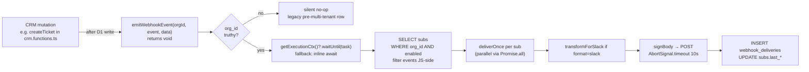

# AGENTS-WEBHOOKS.md — Outbound Webhooks

> Org-level outbound HTTP webhooks. Lives on the CRM, not the agentic backend. Linked from [`AGENTS.md`](./AGENTS.md). Read this when adding or removing a CRM mutation, changing an event payload shape, touching the settings UI surface, or extending recipient formats (Slack, etc).

## TL;DR

Each **org** can register HTTP subscriptions in `/settings → Technical → Webhooks`, pick which CRM events to subscribe to, and choose payload format (`json` envelope or `slack` blocks). Every delivery is HMAC-SHA256 signed against the per-subscription secret, fires fire-and-forget via `ctx.waitUntil`, and is logged in `webhook_deliveries` for visibility. No retries, no DLQ, no filter DSL — that's v2.

## What lives where

```
frontend/
  migrations/0005_webhooks.sql               # webhook_subscriptions + webhook_deliveries
  src/
    db/env.server.ts                         # stashes ExecutionContext alongside env so emit() can ctx.waitUntil
    server.ts                                # passes ctx into runWithEnv
    lib/
      webhooks/
        events.ts                            # WEBHOOK_EVENTS const, WEBHOOK_EVENT_GROUPS, header-name consts
        signing.ts                           # HMAC sign + verify, generateSecret(), secretFingerprint()
        deliver.ts                           # single-shot fetch + delivery-log insert + sub.last_* update
        emit.ts                              # emitWebhookEvent(orgId, event, data): void  — the call-site entry
        slack-format.ts                      # transformForSlack(event, payload) → {text, blocks?}
        slack-format.test.ts                 # bun:test
        subscriptions.server.ts              # D1 helpers used by the server-fns layer
        test-payloads.ts                     # deterministic samples for the "Send test" button
        types.ts                             # WebhookSubscriptionRow, WebhookDeliveryRow, parseEvents()
        demo-seed.ts                         # dev-only seeded "Demo Slack" subscription (enabled=0)
      webhooks.functions.ts                  # 7 server-fns: list, create, update, regenerate, reveal, delete, listDeliveries, sendTest
    components/
      webhooks-settings-section.tsx          # <WebhooksSettingsSection /> — list + dialogs + delivery log
    routes/_authenticated/settings.tsx       # mounts <WebhooksSettingsSection /> in the Technical tab
```

The original design docs were authored under `.maestro/playbooks/` during build-out; that folder is gitignored, so the implementation files above are the canonical source of truth now.

## Data model

Two tables in `0005_webhooks.sql`:

```sql
webhook_subscriptions(
  id TEXT PK, org_id TEXT FK→organizations,
  name TEXT, url TEXT, secret TEXT,            -- secret: 32 random hex bytes (64 chars)
  events TEXT,                                 -- JSON array of event-name strings
  format TEXT CHECK IN ('json', 'slack'),
  enabled INTEGER DEFAULT 1,
  created_by, created_at,
  last_delivery_at, last_status                -- bookkeeping for UI
)

webhook_deliveries(
  id TEXT PK, subscription_id TEXT FK, org_id TEXT FK,
  event TEXT, payload_json TEXT,
  status INTEGER,                              -- HTTP status, 0 on connection error
  response_snippet TEXT,                       -- first 500 chars of response body
  duration_ms INTEGER, succeeded INTEGER, error TEXT,
  attempted_at TEXT
)
```

Foreign keys cascade on org / subscription delete so a deleted sub takes its delivery history with it. Indexes on `(org_id, enabled)` for emit-time lookup and `(subscription_id, attempted_at DESC)` for the UI's recent-deliveries query.

## Event catalog (v1 — 12 events)

This list is **canonical**. The const lives at `frontend/src/lib/webhooks/events.ts`. Adding a new event means:

1. Add to `WEBHOOK_EVENTS` and to the right `WEBHOOK_EVENT_GROUPS` entry.
2. Add a sample to `test-payloads.ts`.
3. Add a Slack template branch to `slack-format.ts` (or rely on the fallback).
4. Wire the emit at the mutation site (see below).
5. Update the table here.

| Event                      | Fires from                                            | `data` shape                                            |
| -------------------------- | ----------------------------------------------------- | -------------------------------------------------------- |
| `contact.created`          | `upsertContact` (INSERT branch only)                  | `{ contact: <row> }`                                     |
| `contact.archived`         | `archiveContact`                                      | `{ contact_id, archived_at }`                            |
| `contact.stage_changed`    | `maybeAdvanceStage` (helper) + `advanceStageManually` | `{ contact_id, from_stage, to_stage }`                   |
| `deal.created`             | `createDeal`                                          | `{ deal: <row> }`                                        |
| `deal.stage_changed`       | `updateDealStage` (non-terminal)                      | `{ deal_id, from_stage, to_stage }`                      |
| `deal.won`                 | `updateDealStage` (→ won)                             | `{ deal: <row>, value }`                                 |
| `deal.lost`                | `updateDealStage` (→ lost)                            | `{ deal: <row> }`                                        |
| `lead.created`             | *not wired yet* — only `INSERT INTO leads` site is `seedDemo` and the public ingest path doesn't create leads | `{ lead: <row> }` (planned) |
| `ticket.created`           | `createTicket`                                        | `{ ticket: <row> }`                                      |
| `ticket.status_changed`    | `updateTicket` (any status flip)                      | `{ ticket_id, from_status, to_status }`                  |
| `ticket.resolved`          | `updateTicket` (→ resolved) — **also** fires `status_changed`, intentional double-emit | `{ ticket: <row> }`         |
| `purchase.created`         | `routes/api/public/ingest.ts`                         | `{ purchase: <row>, contact_id }`                        |

Resolve-emits **double-fire** on purpose (`ticket.status_changed` + `ticket.resolved` for the same write). Subscribers pick what they want. Same shape — different semantics.

## Wire format

### Generic JSON (`format = 'json'`)

```json
{
  "id": "evt_…",
  "event": "deal.won",
  "org_id": "org_cremasales",
  "occurred_at": "2026-05-19T17:42:11.039Z",
  "data": { "deal": {…}, "value": 48000 }
}
```

Headers on every POST:

| Header                 | Value                                                          |
| ---------------------- | -------------------------------------------------------------- |
| `content-type`         | `application/json`                                             |
| `user-agent`           | `Crema-Webhooks/1.0`                                           |
| `x-crema-event`        | event name (e.g. `deal.won`)                                   |
| `x-crema-delivery-id`  | the `webhook_deliveries.id` of this attempt                    |
| `x-crema-timestamp`    | unix seconds at sign time (string)                             |
| `x-crema-signature`    | `sha256=<hex>` — `hmac_sha256(secret, "${ts}.${rawBody}")`     |

Verification on the recipient side: recompute the HMAC over `${ts}.${rawBody}` and constant-time compare. Including the timestamp in the signed material is the Stripe / GitHub convention and lets receivers reject replays by enforcing a freshness window. Our `verifyBody()` in `signing.ts` does the constant-time compare via XOR; copy that pattern.

### Slack preset (`format = 'slack'`)

The same delivery code path, but `transformForSlack(event, payload)` (in `slack-format.ts`) substitutes the body for a Slack incoming-webhook shape (`{text, blocks}`). One template function per event with shared small block-builder helpers (`header(text)`, `section(text)`, `fields(pairs)`). Money is formatted with `Intl.NumberFormat('en-US', {style:'currency', currency:'USD', maximumFractionDigits:0})` — no half-dollars on stage.

HMAC headers are still emitted in slack format (harmless to Slack, useful if the receiver isn't actually Slack). The Slack URL itself is the security boundary in that mode.

## Emit topology



Key invariants:

1. **`emitWebhookEvent` is `void`, not `async`.** Callers do not `await` it. Latency stays at zero. The lookup itself is async and gets shoved into `ctx.waitUntil` (or runs inline if no ctx is available — tests, prerender).
2. **Post-write only.** Emit *after* the D1 mutation succeeds. Never inside a transaction. Never before validation. A webhook firing for a write that later threw is the worst failure mode.
3. **Null `org_id` skips.** Pre-multi-tenant rows still mutate cleanly; they just don't route webhooks. Add a TODO when wiring a new emit site if there's any chance the row predates the org column.
4. **Pre-read for state-change events.** `contact.stage_changed`, `deal.stage_changed`, `ticket.status_changed` need the previous value — read the row before the UPDATE, then update, then emit.

## Auth & access control

- Subscription CRUD requires `requireAuth` middleware + `isMember(org_id, userId)` (mirrors `org-fns.ts`).
- The raw `secret` is returned **only** by `createWebhook`, `regenerateWebhookSecret`, and `revealWebhookSecret`. Every `listWebhooks` response shows a `secretFingerprint(secret)` (first 8 chars of `sha256(secret)` hex) instead.
- 20-subscriptions-per-org cap enforced in `createWebhook`.
- URL allow-list: `https://*` always; `http://` only for `localhost`, `127.0.0.1`, `webhook.site`. Mirrored client-side in the create dialog for instant feedback.

## Failure model

- One attempt. 10s timeout via `AbortSignal.timeout(10_000)`. Non-2xx or network error → `webhook_deliveries.succeeded = 0` with `status` / `error` filled in.
- We **never** retry. The UI shows the failure and exposes a "Send test" affordance to retry by hand.
- `deliverOnce` **never throws**. Catching internal errors is essential because a thrown error inside `ctx.waitUntil` produces no user-visible response — it'd disappear silently. Internal errors are caught + `console.error`'d so they show up in `wrangler tail`.

## Settings UI surface

`<WebhooksSettingsSection />` (in `components/webhooks-settings-section.tsx`) renders three Cards:

1. **Subscriptions list** — row per sub with name, truncated URL (+ tooltip), event count, format chip, enabled Switch, last-delivery relative time + status badge, and an actions DropdownMenu (Edit / Reveal secret / Regenerate / Send test / Delete). "Add webhook" CTA opens the create dialog.
2. **Recent deliveries** — last 25 across the org, collapsible row expansion shows pretty-printed payload + response snippet (or `error` for failed rows).
3. **How verification works** — three short paragraphs on the signing scheme + a curl-pattern verifier code block (pulled from this doc).

The section is mounted inside the **Technical** tab of the new tabbed settings layout, alongside the inbound `IngestWebhookSection` and `TrackingSnippetSection`. The empty-state ("Join an org to configure webhooks") renders when there is no active org.

## Test the path locally

1. `cd frontend && bun run dev`
2. Log in. Go to `/settings → Technical → Webhooks`.
3. Click **Add webhook**. Point it at `https://webhook.site/<token>` (grab one from https://webhook.site). Subscribe to a few events. Format JSON.
4. Copy the secret shown in the post-create dialog.
5. Click **Send test** on the row, pick an event. Within ~2s a 200-status row should appear in **Recent deliveries**.
6. Verify the HMAC: `node -e "const c=require('crypto');const h=c.createHmac('sha256','<secret>').update('<ts>.'+'<raw body>').digest('hex');console.log('sha256='+h)"` should match the `x-crema-signature` header webhook.site shows.
7. Trigger a real mutation in the CRM (create a deal, win it). Within ~2s a fresh `deal.won` delivery row should land.

## v1 non-goals (don't add without explicit ask)

- Inbound webhooks (the `/api/public/ingest` and `/t/<guid>.js` snippet are the inbound surfaces — different feature).
- Per-event filter DSL (JSONPath / expressions). Subscribe-by-name only.
- Cloudflare Queues + DLQ. We use `ctx.waitUntil` for fire-and-forget.
- Retries with exponential backoff. Best-effort once. UI surfaces failures.
- Per-user (rep-level) webhooks. Org-level only.
- `ticket.sla_breached`. Cron-dependent; deferred.

## Future hooks (v2 candidates)

- Cron-driven `ticket.sla_breached` (the SLA tracker already lives in `crm.functions.ts`; wire it to a scheduled handler).
- Retry queue via Cloudflare Queues for failed deliveries with exponential backoff and a "redeliver" button.
- Per-subscription filter expression (start with `data.deal.value >= 10000`-style; do not invent a DSL).
- Webhook recipient health metric — last 7d success rate on the row card.

## Reference / inspiration

- **Stripe Webhooks** — `Stripe-Signature: t=…,v1=…` over `${t}.${body}`. We use a flatter header layout but the verification logic is identical.
- **GitHub Webhooks** — `X-Hub-Signature-256: sha256=…` over raw body. We copied the shape and added the timestamp for replay protection.
- **Slack Incoming Webhooks** — `{text, blocks}`. Our `format=slack` emits this directly.
