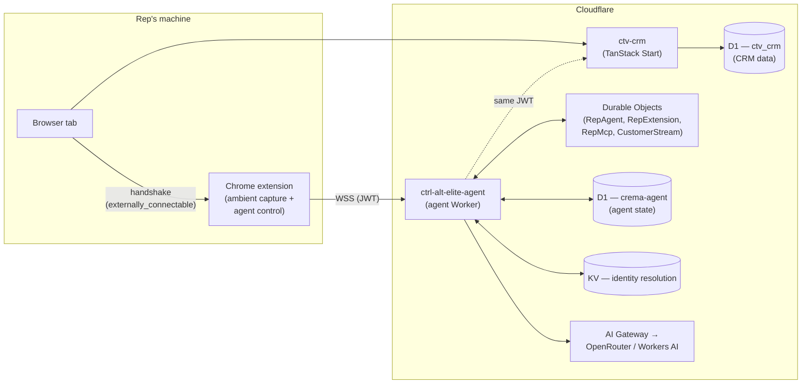

# Crema-CRM

The Crema Sales monorepo — TanStack Start CRM web app, Cloudflare Workers agent backend, Chrome extension, shared protocol schemas, and data tooling. Everything that runs the product lives here.

```
.
├── frontend/         # TanStack Start CRM web app (D1 schema, server-fns, webhooks)
├── backend/          # Cloudflare Workers agent (RepAgent DO, MCP, extension broker)
├── extension/        # Chrome MV3 extension (BETA) — ambient capture + agent control
├── shared/           # Zod schemas + WS protocol spec (imported by both halves)
├── cli/              # `crema` — dependency-free CLI for the public REST API
├── tools/
│   └── data-generator/   # CLI for seeding D1 with realistic test data
├── docs/             # PRDs, coach personas, architecture notes
└── .github/workflows/    # CI — extension release on push to main
```

## Architecture



## Quick start

### Frontend (CRM web app)

```bash
cd frontend
cp .env.example .env                                # fill in Resend etc.
bun install
bunx wrangler d1 migrations apply ctv_crm --local
./run-local.sh                                      # → http://localhost:5173
```

Production deploy:

```bash
cd frontend
bun run deploy                                       # vite build && wrangler deploy
bunx wrangler d1 migrations apply ctv_crm --remote   # only when new migrations land
```

Details in [`frontend/DEPLOY.md`](./frontend/DEPLOY.md) and [`AGENTS-DEVOPS.md`](./AGENTS-DEVOPS.md).

### Backend (agent Cloudflare Worker)

```bash
cd backend
cp .dev.vars.example .dev.vars                       # fill in OPENROUTER_API_KEY etc.
bun install
bunx wrangler d1 migrations apply crema-agent --local
bun run dev                                          # → http://localhost:8787
```

Production deploy: `bun run deploy` from `backend/`. Full deploy reference: [`backend/README.md`](./backend/README.md) and [`AGENTS-WORKERS.md`](./AGENTS-WORKERS.md).

### Extension (Chrome MV3) — BETA

> **Status: beta / under active development.** The extension is shipping behind a beta badge on the website. APIs, the website handshake contract, and on-disk storage shape are all still in motion — expect rough edges, frequent rebuilds, and the occasional breaking change between releases. File issues liberally.

```bash
cd extension
bun install
bun run build      # outputs ./dist
```

Then in Chrome: `chrome://extensions` → toggle **Developer Mode** → **Load unpacked** → select `extension/dist`.

Pre-built zips are published on every push to `main` that touches `extension/**` or `shared/**` via the `Release Extension` workflow — grab the latest from [Releases](https://github.com/Crema-Sales/Crema-CRM/releases). Releases are marked as **pre-releases** on GitHub for the duration of the beta.

### CLI (`crema`)

A dependency-free command-line client for the public REST API at
`https://cremasales.com/api/v1`. Every endpoint is exposed as a subcommand, so
the same binary works as both a human tool and a capability layer for
autonomous AI agents driving Crema on a user's behalf.

```bash
cd cli
bun install              # dev-only types; the CLI itself has zero deps
bun link                 # exposes `crema` on $PATH (or run ./crema.ts in place)
crema configure          # interactive: prompts for an API key (mint one in
                         # the web app under Sidebar → CLI / API → CLI)
crema me                 # smoke-test the key
crema actions --json     # machine-readable output for scripts and agents
```

Full reference, agent contract, and the `raw` escape hatch for any endpoint:
[`cli/README.md`](./cli/README.md).

### Data generator

```bash
cd tools/data-generator
bun install
./datagen --help
```

## Contributing

This is an open-source project. PRs welcome. Before opening one:

- Read [`AGENTS.md`](./AGENTS.md) — describes the project's coding conventions, the architecture-doc index, and how AI agents are expected to work in this repo.
- For security issues, see [`SECURITY.md`](./SECURITY.md).

## License

[MIT](./LICENSE) — © 2026 Pedram Amini, Alex Hessler, Jon Irvine.
