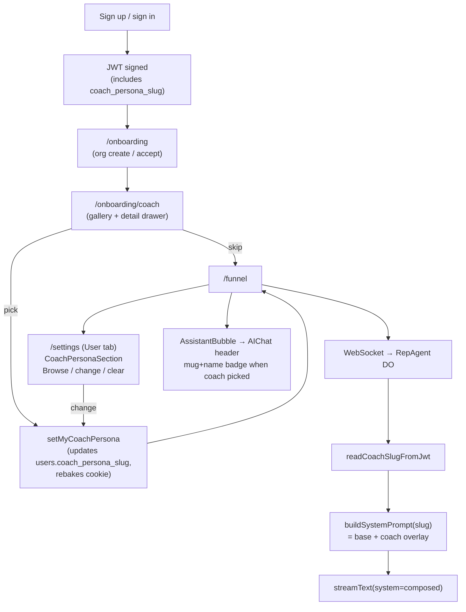

# Coach Personas

Reps can optionally pick a sales-coach archetype during onboarding. Once
picked, the in-app copilot adopts that coach's voice, vocabulary, and
reaction patterns when chatting with the rep — within the existing Crema
scope and safety rails.

The 12 launch personas are research-grounded sketches of well-known
sales-coaching figures (Andy Elliott, Brian Tracy, Chris Voss, Dan Lok,
Gary Vaynerchuk, Grant Cardone, Jeb Blount, John Barrows, Jordan Belfort,
Russell Brunson, Tony Robbins, Zig Ziglar). Source markdown lives in
`scratch/pedram/personalities/`.

## Architecture

## Data flow

| Layer | File | What it stores |
|---|---|---|
| DB | `frontend/migrations/0011_coach_personas.sql` | `users.coach_persona_slug TEXT NULL` |
| JWT | `frontend/src/auth/crypto.ts` (`JwtPayload`) | `coach_persona_slug?: string \| null` |
| Frontend catalog | `frontend/src/lib/coach-personas.ts` | Full persona detail (catchphrases, techniques, sales contexts, headshot path, voiceNotes) |
| Backend mirror | `backend/src/coach-personas.ts` | Slim slug → voiceNotes map for prompt composition |
| Prompt composer | `backend/src/agent-prompts.ts::buildSystemPrompt` | Base SYSTEM_PROMPT + coach overlay if slug present |
| Headshots | `frontend/public/coach-personas/<slug>.{png,jpg}` | Self-hosted images served at `/coach-personas/<slug>.<ext>` |
| Reusable picker UI | `frontend/src/components/coach-picker.tsx` | `CoachPickerGallery` (inline) + `CoachPickerDialog` (modal) — used by onboarding and settings |
| Settings panel | `frontend/src/components/coach-persona-section.tsx` | Card in User tab — shows current coach, opens picker, clears slug |
| Chat header badge | `frontend/src/components/assistant/AIChat.tsx` | Mug shot + first name next to chat title when a coach is set |

## Sales contexts

Each persona is tagged with one or more of `consumer`, `smb`, `enterprise`.
The onboarding gallery shows chips for these and supports filtering. Picking
the right tagging is a content judgment — see the research markdown in
`scratch/pedram/personalities/<slug>.md` for the underlying rationale.

## Adding a coach

1. Author the research markdown at `scratch/pedram/personalities/<slug>.md`
   following `_TEMPLATE.md`.
2. Drop the headshot at `frontend/public/coach-personas/<slug>.<ext>`.
3. Append an entry to `COACH_PERSONAS` in
   `frontend/src/lib/coach-personas.ts`.
4. Append a matching `{ slug, name, voiceNotes }` to
   `COACH_PERSONA_VOICES` in `backend/src/coach-personas.ts`. Keep
   `voiceNotes` byte-for-byte identical between the two files.
5. Ship. No DB migration required.

## Updating an existing coach

Edit both `frontend/src/lib/coach-personas.ts` and
`backend/src/coach-personas.ts`. The frontend file is the gallery / detail
source of truth; the backend file is the prompt overlay source. The two
`voiceNotes` strings must match.

## Drift risk

The frontend and backend persona files duplicate `voiceNotes` by design —
we don't want the backend Worker pulling in 30KB of catchphrase / technique
data it doesn't use. If they drift, the rep will see one coach in the
gallery and feel a different coach in chat. A future refactor can move the
shared subset into `shared/` if the maintenance burden becomes real.

## Persona changes after onboarding

Updating the coach from `/settings` immediately rewrites the user row and
rebakes the auth cookie. But an *open* WebSocket connection to the agent
Durable Object will keep using the JWT it received at upgrade — the persona
won't switch mid-conversation. The settings copy tells reps to close and
reopen the assistant popover to pick up the new voice. A future iteration
could send the agent a refresh signal on coach change instead.

## Out of scope (still)

- Headshot optimization. Some images ship at multi-MB resolution
  (chris-voss.jpg is ~3.8MB). Compress / convert to WebP if gallery load
  becomes a real problem.
- Live persona swap. As noted above, changing coach in settings requires
  reopening the chat to take effect.
- SMB / Enterprise tagging validation. The contexts assigned to each
  persona are a best-guess from the underlying research markdown — if a
  rep filters Consumer and a persona feels misplaced, retag in
  `frontend/src/lib/coach-personas.ts`.
