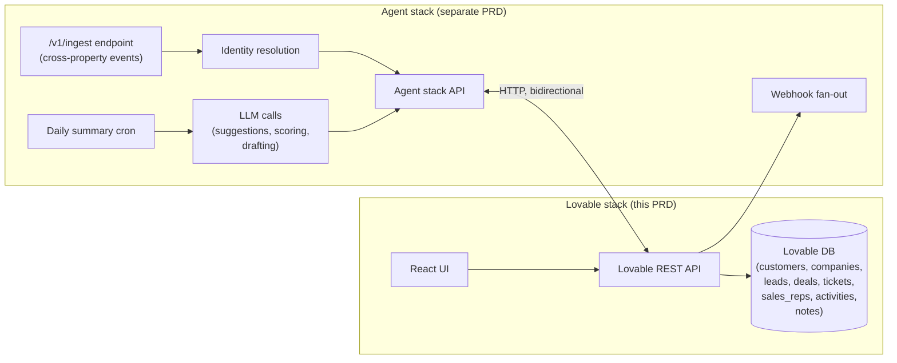
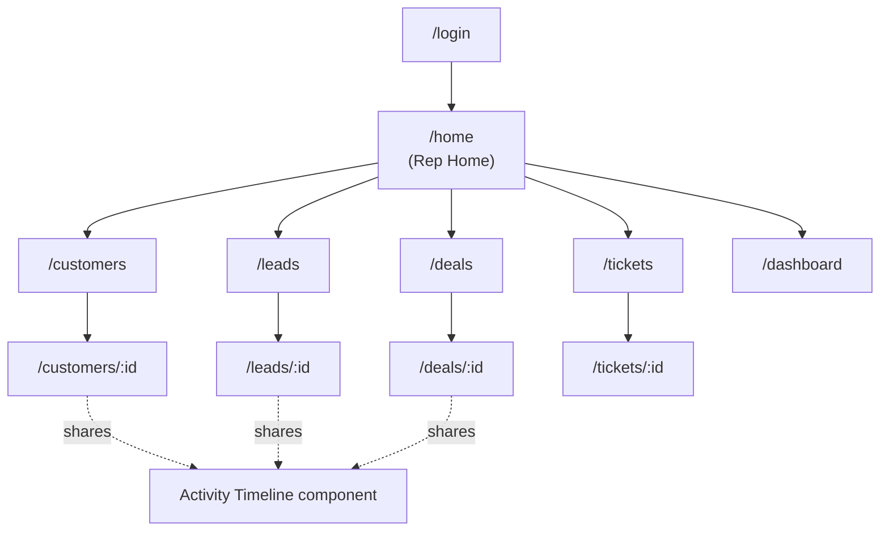
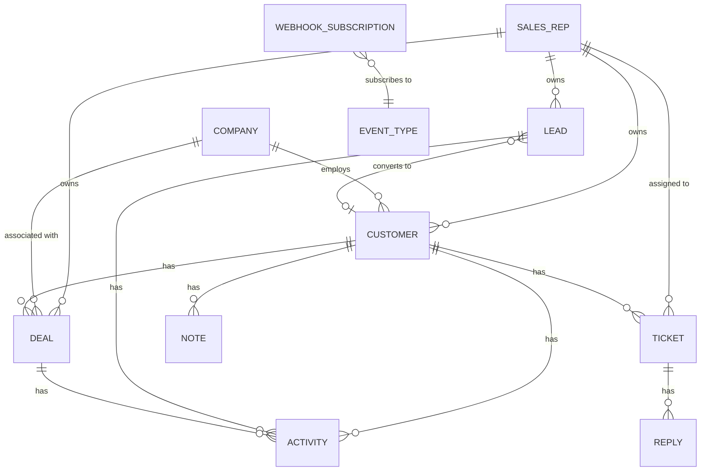

# CremaSales — Master PRD (Lovable Scope)

> Successor to `scratch/jon/lovable-prd.md` (the "Pulse" draft). Product is now **CremaSales** (cremasales.com). This document is the authoritative spec for the Lovable side of the build.
>
> **Design language is intentionally absent from this document.** The Lovable app has an evolved theme already implemented in code — that is the canonical source for typography, color, spacing, motion, and any other visual decision. This PRD only specifies *what features exist, what data shapes flow through them, and what API surfaces them*. Add features within the existing design language; do not redefine it.
>
> Read alongside: [`REQUIREMENTS.md`](../../REQUIREMENTS.md) (judges' brief), [`scratch/pedram/01-crm-assessment.md`](../pedram/01-crm-assessment.md) (architecture + hour-by-hour plan), [`scratch/pedram/old-guard.md`](../pedram/old-guard.md), [`scratch/pedram/new-guard.md`](../pedram/new-guard.md), and [`scratch/pedram/feedback.md`](../pedram/feedback.md) (voice-of-customer).

---

## 1. Status & Scope

### 1.1 What this PRD covers

CremaSales runs on **two completely separate stacks** that communicate over HTTP:



**Lovable owns:**
- All CRUD screens (customers, companies, leads, deals, tickets, sales reps, contacts, activities, notes)
- User authentication + role-based views
- The pipeline kanban (deals, leads)
- All list / filter / search UI
- Activity timeline rendering
- Rep home / "today" view (the prioritized action list — rendered from data Lovable receives)
- Sales-rep and manager dashboards
- Webhook subscription UI (the form; the actual fan-out is on the agent stack)
- Onboarding modal for first-time judges
- Command palette + keyboard shortcuts
- All charts and metrics rendering

**Lovable does NOT own:**
- The `/v1/ingest` endpoint and cross-property identity resolution
- LLM calls (email drafting, deal-stage suggestion, summarization, scoring)
- The daily-summary cron job
- The webhook fan-out queue itself
- Any external data enrichment

### 1.2 Resilience principle

**The Lovable app must function fully on its own, with no agent stack present.** Every agentic enhancement degrades gracefully:

| Feature | Agent stack present | Agent stack absent / down |
|---|---|---|
| Prioritized action list | Uses agent-computed score per customer | Falls back to a local SQL/aggregate score: `open_tickets × 3 + (lead_score or 0) + days_since_contact` |
| AI-suggestion chip on fields | Renders the suggestion text returned by the agent | Chip is hidden; manual edit still works |
| Daily summary card on dashboard | Renders agent-generated text | Card hidden; rest of dashboard works |
| Activity timeline | Includes events ingested via agent stack `/v1/ingest` | Shows only events written directly to Lovable's CRUD APIs |

This separation means the demo will function with or without the agent stack live — critical for the hour-by-hour plan in `01-crm-assessment.md`.

---

## 2. Personas (condensed)

Lifted from the predecessor PRD; included only to anchor design decisions.

- **Sales Representative (primary user)** — daily priorities, follow-ups, pipeline view, communication history, log calls/notes.
- **Sales Manager** — pipeline health, rep performance, team metrics, forecasting.
- **Customer Support** — ticket queue, escalation alerts, customer context.
- **Founder / Executive** — high-level revenue trends, conversion, churn.
- **Onboarding Judge (build-specific)** — opens the URL cold, has 60-90 seconds to "get it," will not be guided by a team member. The onboarding flow is built for this persona.

---

## 3. The four MUSTs (from REQUIREMENTS.md)

Non-negotiable. Each MUST maps to specific screens below.

| # | Requirement (verbatim) | Screen(s) that fulfill it |
|---|---|---|
| 1 | A sales representative must be able to log in and view their assigned customers and leads. | §6.1 Login → §6.3 Rep Home + §6.4 Customers list (default scope: `assigned_rep_id = me`) + §6.6 Leads list |
| 2 | A sales representative must be able to drill down into a prioritized list of actions. | §6.3 Rep Home (action list is the centerpiece, above the fold) |
| 3 | A sales representative must be able to view, create, modify, and delete customer records. | §6.4 Customers list + detail with full CRUD |
| 4 | Customer activity from across the company's properties must be consumable by the CRM and update the appropriate customer records. | §6.4.3 Customer Detail → Activity tab (the timeline) — fed by the agent stack via Lovable's API |

If any of these four does not work end-to-end at demo time, **we have failed the brief**.

---

## 4. Information Architecture

### 4.1 Routes

| Route | Screen | Auth | Role |
|---|---|---|---|
| `/login` | Login | public | — |
| `/` | Redirect → `/home` if authed, else `/login` | — | — |
| `/home` | Rep Home (today view) | required | rep, manager |
| `/customers` | Customers list | required | rep, manager |
| `/customers/:id` | Customer detail | required | rep, manager |
| `/companies` | Companies list | required | rep, manager |
| `/companies/:id` | Company detail | required | rep, manager |
| `/leads` | Leads list (kanban + table toggle) | required | rep, manager |
| `/leads/:id` | Lead detail | required | rep, manager |
| `/deals` | Deals kanban | required | rep, manager |
| `/deals/:id` | Deal detail | required | rep, manager |
| `/tickets` | Tickets queue | required | rep, manager, support |
| `/tickets/:id` | Ticket detail | required | rep, manager, support |
| `/reps` | Sales reps list | required | manager |
| `/reps/:id` | Sales rep profile | required | rep (self), manager |
| `/dashboard` | Rep dashboard | required | rep |
| `/manager` | Manager dashboard | required | manager |
| `/settings/webhooks` | Webhook subscriptions | required | manager |
| `/settings/api-keys` | API keys (read-only) | required | manager |

### 4.2 Navigation

Persistent left sidebar with primary routes. Top bar with: global search (focused by `/`), command palette trigger (⌘K), notifications icon, current rep avatar with role switcher in the demo build.



---

## 5. Demo & Anonymity Constraints (build-specific)

Lifted directly from `REQUIREMENTS.md` so Lovable doesn't accidentally violate them:

- **Anonymity:** no team-identifying information anywhere in the app surface (no team name, no team avatars, no team-specific copy). The product name **CremaSales** is fine; it's the brand.
- **Onboarding for cold-opened judges:** first-time login must trigger a brief 3-step explainer modal. See §7.
- **Demo mode:** behind a feature flag (`DEMO_MODE=true` by default for this build), the top-bar avatar exposes a **role switcher** to flip between sales rep accounts and a manager account without re-authentication. This lets judges see all four MUSTs end-to-end in one session.
- **Empty states must never be blank.** Every list view, every detail tab, every dashboard card must have a styled empty state with a single suggested next action ("Create your first customer," "No tickets — try the demo button").

---

## 6. Screens

Each screen is specified by: **purpose · data it consumes · components · interactions · empty/loading/error states**. The "data shape" subsections describe the JSON Lovable's components must render — not the storage representation.

### 6.1 Login (`/login`)

**Purpose:** Authenticate as a sales rep or manager. For the demo, magic-link is the primary path with OAuth (Google, GitHub) as fallback.

**Components:**
- Email input
- "Send magic link" CTA
- OR divider
- "Continue with Google" button
- "Continue with GitHub" button
- "Continue as demo judge" link (visible only when `DEMO_MODE=true`) — bypasses auth, drops into `/home` as the seed rep `rep_alex`.

**Behavior:**
- Magic-link calls `POST /api/auth/magic-link {email}` → backend returns 200 with no body; UI shows "Check your email."
- OAuth uses standard redirect flow.
- "Continue as demo judge" calls `POST /api/auth/demo` → backend returns a session cookie for `rep_alex` and redirects to `/home`.

**Empty state:** N/A.
**Loading:** CTA shows spinner during request.
**Error:** Inline error under the email field for malformed / unknown emails. OAuth errors redirect back to `/login?error=...` with a banner.

### 6.2 First-time onboarding modal

**Purpose:** Cold-opened judges get the app in 60 seconds.

**Triggered:** First successful `/home` load per browser (localStorage flag `cremasales.onboarded = true`).

**Content (3 panes, swipeable + dot indicator):**
1. **Your day at a glance** — "CremaSales gives every rep a prioritized list of what to do next. The CRM tells you who to call, not the other way around."
2. **One customer record, every signal** — "Every interaction — email, web visit, support form, manual note — flows into one timeline per customer. You never type the same thing twice."
3. **Ready when you are** — "Pipeline, deals, tickets, dashboards. Everything a rep needs is one keystroke away (try ⌘K)."

Each pane has a "Skip" and "Next" / "Got it" CTA. Final "Got it" sets the localStorage flag and dismisses.

**Re-trigger:** A "Show onboarding again" link lives in `/settings`.

### 6.3 Rep Home — "Today" (`/home`) — fulfills MUST #1 and #2

**Purpose:** The single most important screen in the app. Opens with a greeting, then the prioritized action list, then quick stats. This is the front door.

**Layout:** Single column, max-width centered. Three vertical sections.

#### 6.3.1 Header

- Greeting: `Good {morning | afternoon | evening}, {rep.first_name}`
- Date line: today's full date
- Optional daily-summary card (only when the agent stack provides one — see §10.2). Renders the agent's HTML/text summary. Has a "Refresh" link that calls the agent endpoint.

#### 6.3.2 Prioritized action list (the centerpiece — MUST #2)

A single column of action cards, sorted by `priority_score` descending. Each card is a discrete unit of work.

**Action card shape:**
```json
{
  "id": "action_01HX...",
  "type": "call_customer | follow_up_lead | check_ticket | review_deal | log_meeting",
  "priority_score": 92,
  "priority_score_source": "agent | local",
  "verb": "Call",
  "subject": "Sarah Chen at GreenLeaf Inc.",
  "reason": "Opened pricing page 3× this week + open ticket pending 4 days",
  "due_at": "2026-05-18T15:00:00Z",
  "linked_record": { "type": "customer", "id": "cust_01HX..." },
  "actions": [
    { "id": "open", "label": "Open record" },
    { "id": "log_call", "label": "Log call" },
    { "id": "snooze", "label": "Snooze 1h" }
  ]
}
```

**Card visible content:**
- Verb (large) — `Call`, `Follow up`, `Review`, etc.
- Subject — name + company (clickable → opens the linked record)
- Reason — one sentence, plain English
- Due time (if any) — e.g., "Due 3:00 PM"
- Priority badge (numeric or color-coded; let the design language decide)
- An "AI:" chip prefix ONLY when `priority_score_source === "agent"` — surfaces that the ranking is agent-derived (transparent, per feedback.md negative #3 and positive #12)

**Interactions:**
- Click anywhere on the card → navigate to `linked_record`
- "Log call" → opens log-call modal (§8.3)
- "Snooze 1h" → optimistic remove from list; calls `POST /api/actions/:id/snooze`
- Keyboard: `j`/`k` to move cursor, `Enter` to open, `c` to log call, `s` to snooze

**Empty state:** "You're all caught up. Take a breath." with a secondary CTA "View all customers."

**Data shape (the API Lovable consumes):**
```json
GET /api/home/:rep_id/actions
{ "actions": [ ... ], "as_of": "2026-05-18T09:00:00Z" }
```

#### 6.3.3 Quick stats row (below the action list)

Four small cards:
- **Open deals** (count + total value)
- **Leads this week** (count + delta vs last week)
- **Open tickets** (count + count at SLA risk)
- **Activity this week** (count + sparkline if the design lib supports it)

Each card links to its respective list view with the appropriate filter pre-applied.

### 6.4 Customers — fulfills MUST #3

#### 6.4.1 Customers list (`/customers`)

**Default scope:** `assigned_rep_id = current_user.id`. Toggle to "All customers" (visible to all roles; default-on for managers).

**Columns (table view):** Name · Company · Status · Ideal-customer chip · Last activity · Next action · Owner.

**Filter bar:**
- Status: dropdown (Active, Lead, Churned, On Hold, etc.)
- Priority: dropdown (High, Medium, Low — computed from `priority_score` thresholds)
- Owner: rep picker (default: me)
- Last contacted: time-range picker (Today, This week, This month, Older)
- Ideal customer: toggle chip
- Tags: multi-select chip group

**Search:** Top-bar global search filters this list when scoped to `customers`. Also a per-page search input.

**Saved views:** A user can save the current filter combo as a named view (e.g., "My ideal customers without contact this week"). Saved views appear as chips above the table.

**Bulk actions** (multi-select on rows): Assign to rep, Add tag, Export CSV, Delete (confirm modal).

**Empty state:** "No customers match these filters. Clear filters or [Create your first customer]."

**Data shape:**
```json
GET /api/customers?assigned_rep_id=me&status=active&priority=high&q=acme&page=1&per_page=50
{
  "items": [
    {
      "id": "cust_01HX...",
      "name": "Sarah Chen",
      "email": "sarah@greenleaf.com",
      "phone": "+1-415-555-0103",
      "company": { "id": "co_01HX...", "name": "GreenLeaf Inc." },
      "status": "active",
      "priority_score": 92,
      "ideal_customer": true,
      "last_activity_at": "2026-05-17T22:14:00Z",
      "next_action": { "verb": "Call", "due_at": "2026-05-18T15:00:00Z" },
      "owner": { "id": "rep_alex", "name": "Alex" },
      "tags": ["enterprise", "renewing"]
    }
  ],
  "total": 124,
  "page": 1,
  "per_page": 50
}
```

#### 6.4.2 Create customer (modal or `/customers/new`)

**Required fields:** Name only. Everything else is optional — minimal mandatory fields, per `feedback.md` negative #14.
**Optional fields shown by default:** Email, Phone, Company (autocomplete-linked), Status, Owner (default: current user), Tags.
**"More" expander:** Address, Notes, custom tags, ideal-customer override toggle.

#### 6.4.3 Customer detail (`/customers/:id`) — fulfills MUST #4

Three-pane layout (universal old-guard convention; cf. `old-guard.md` §"What's worth stealing"):

```
[ Left rail        ] [ Main pane                                    ] [ Right rail       ]
[ List of recent   ] [ Header: name, company, status, ideal chip    ] [ Contact details  ]
[ customers (this  ] [ Tabs: Overview · Activity · Deals · Tickets  ] [ Recent activity  ]
[ rep's queue) for ] [        · Notes · Files                       ] [   (last 5)       ]
[ rapid traversal  ] [                                              ] [ Next action card ]
[                  ] [ <tab content>                                ] [ AI suggestions   ]
[                  ] [                                              ] [   (if any)       ]
```

**Header:**
- Avatar / initials
- Name (inline-editable on click — see Cross-cutting §8.4)
- Company link
- Status pill (Active / Lead / Churned / On Hold) — clickable to change
- **Ideal-customer chip** when `ideal_customer === true`
- Action buttons: Log call · Log email · Log note · Log meeting · Create deal · Create ticket

**Tabs:**

##### Overview tab
- Summary block (1-2 lines, may be agent-provided)
- Key facts grid: lifetime value, deals count, open tickets count, days since last contact, lead source, signup date
- "AI suggestions" panel — list of agent-provided suggestions (e.g., "Stage suggests: Negotiation based on last call"). Each has Accept / Dismiss. Hidden when no suggestions.

##### Activity tab — the timeline (this is the MUST #4 surface)
- Reverse-chronological feed, grouped by day
- Each entry: icon (per source), source chip, summary, timestamp, expand-to-raw button
- Source chips: `email`, `web`, `product`, `support`, `phone`, `meeting`, `manual_note`, `pixel`, `form`
- Filter chips above the feed: All · Manual · Auto-captured · Outbound · Inbound
- "+ Log activity" button → opens log-activity modal with type picker

**Timeline entry shape:**
```json
{
  "id": "act_01HX...",
  "customer_id": "cust_01HX...",
  "type": "email | web_visit | product_event | support_form | phone_call | meeting | manual_note | pixel | form_submitted | feature_used",
  "source": "marketing_site | product_app | email_pixel | support | manual | crm",
  "direction": "inbound | outbound | neutral",
  "summary": "Sarah opened pricing email",
  "occurred_at": "2026-05-17T22:14:00Z",
  "actor": { "type": "system | user", "id": "...", "name": "..." },
  "raw": { /* arbitrary payload — collapsed by default, expandable */ }
}
```

##### Deals tab
- Table of deals tied to this customer (Stage · Value · Owner · Close date · Days in stage)
- "+ Create deal" button

##### Tickets tab
- Table of tickets tied to this customer (Status · Priority · Subject · Opened · SLA state)
- Color/badge state per SLA breach risk
- "+ Create ticket" button

##### Notes tab
- Markdown notes, newest first
- Inline note creation at top of tab
- Each note: author avatar, timestamp, body, edit/delete

##### Files tab (stretch)
- File uploads tied to customer
- Optional — skip if pressed on time

**Right rail:**
- Contact card: email, phone, address, social links, time zone
- Recent activity (last 5, link to "see all")
- Next action card: the same `next_action` shape as on Rep Home
- AI suggestions list (collapsible)

#### 6.4.4 Edit customer

Inline-editable header fields (see §8.4). Full edit modal accessible via "Edit details" in an overflow menu.

#### 6.4.5 Delete customer

Always behind a confirm modal: "Delete Sarah Chen and all linked deals, tickets, and activities? This cannot be undone." Soft-delete on the backend (sets `deleted_at`); list views auto-exclude `deleted_at IS NOT NULL`.

### 6.5 Companies (`/companies`, `/companies/:id`)

**List view:** Name · Industry · # employees · # deals · ARR · Owner · Last activity.
**Filter bar:** Industry, size, owner, last activity, has-open-deal toggle.
**Detail view:** Three-pane layout matching customer detail. Tabs: Overview · People (employees) · Deals · Tickets · Activity · Notes. Same activity timeline component as on customer detail (timeline includes any activity associated with any customer at this company OR the company directly).

**Data shape (detail):**
```json
GET /api/companies/:id
{
  "id": "co_01HX...",
  "name": "GreenLeaf Inc.",
  "domain": "greenleaf.com",
  "industry": "renewable energy",
  "size": "200-500",
  "estimated_arr": "$1M-10M",
  "location": { "city": "San Francisco", "region": "CA", "country": "US" },
  "linked_in": "https://linkedin.com/company/greenleaf",
  "deal_pipeline_summary": { "open_count": 3, "total_value": 248000 },
  "employees": [ { "id": "cust_01HX...", "name": "Sarah Chen", "title": "Head of IT" }, ... ],
  "owner": { "id": "rep_alex", "name": "Alex" },
  "created_at": "...",
  "updated_at": "..."
}
```

### 6.6 Leads (`/leads`) — pipeline view

**View toggle at top:** **Kanban** (default) | **Table**.

#### 6.6.1 Kanban view

Five default columns: **New** → **Qualified** → **Proposal** → **Negotiation** → **Closed Won** (with a separate "Closed Lost" column at the far right, visually distinct).

**Lead card shape (on kanban):**
- Name + company
- Estimated LTV (from `estimated_ltv` field)
- Lead score badge (small)
- Owner avatar
- Days in stage (warns when over a configurable threshold)

**Drag-and-drop:** Cards can be dragged between stages. On drop, optimistic update + `PATCH /api/leads/:id { stage }`. Server confirms; on failure, revert with toast.

**Add new lead:** "+ New lead" button in the New column.

**Column summary:** Each column shows count + total LTV at top.

#### 6.6.2 Table view

Standard columns: Name · Company · Stage · LTV · Score · Source · Owner · Days in stage · Last activity.

Same filters as customers list, plus: stage filter, source filter, score range.

#### 6.6.3 Lead detail (`/leads/:id`)

Same three-pane layout as customer detail. Tabs: Overview · Conversation history · Activity · Notes · Convert.

**Conversation history tab:** Specifically for the "conversation history" requirement from the brief — chronological list of all interactions specifically classified as conversations (emails, calls, meetings, chat) — excludes web events and product events. Each entry expandable to show the full thread.

**Convert tab:** Single action — "Convert to Customer" — opens a modal: select / confirm linked company, confirm initial deal (optional), confirm assignment. Creates a `customer` record, optionally a `deal`, and marks the lead `converted_at`.

#### 6.6.4 Lead lifecycle automation hooks (UI affordances only)

A "Follow-up due" badge appears on lead cards/rows when `next_followup_due_at < now()`. This is rendered by the UI; the *scheduling logic* (which decides what `next_followup_due_at` should be) is on the agent stack. The UI also offers a manual "Set follow-up reminder" action that calls `POST /api/leads/:id/followup { due_at }`.

### 6.7 Deals (`/deals`)

Kanban-primary, just like leads. Stages are configurable per workspace but seeded with: **Prospecting** → **Qualification** → **Proposal** → **Negotiation** → **Closed Won** / **Closed Lost**.

**Deal card on kanban:**
- Deal name
- Value (currency-formatted)
- Customer / company link
- Close date (if set)
- Owner avatar
- Probability badge (0-100%, if set)

**Detail view (`/deals/:id`):** Header with name, value, stage, probability, close date. Tabs: Overview · Activity · Linked tickets · Notes.

**Data shape (deal):**
```json
{
  "id": "deal_01HX...",
  "name": "GreenLeaf Q3 expansion",
  "customer_id": "cust_01HX...",
  "company_id": "co_01HX...",
  "stage": "negotiation",
  "value": 248000,
  "currency": "USD",
  "probability": 0.7,
  "close_date": "2026-06-30",
  "owner_id": "rep_alex",
  "created_at": "...",
  "updated_at": "...",
  "days_in_stage": 12
}
```

### 6.8 Tickets (`/tickets`) — customer service surface

**Queue view (default):** Sorted by SLA breach risk descending.

**Columns:** Subject · Customer · Status (Open / Pending / Resolved / Closed) · Priority (Low / Medium / High / Urgent) · SLA state (On track / At risk / Breached) · Assigned to · Opened.

**Filter bar:** Status, Priority, SLA state, Assigned-to, Customer (autocomplete).

**Detail view (`/tickets/:id`):**
- Header: subject, status pill, priority, customer link, opened-at, SLA countdown
- Body: original report (multi-paragraph)
- Conversation: chronological replies (from customer and from internal team), each with timestamp and author
- "Reply" composer at the bottom — markdown supported, posts via `POST /api/tickets/:id/replies`
- Internal-note toggle on the composer (visible only to team)
- Side rail: customer card (mini), linked deals (if any), tags
- Actions: Change status, Reassign, Escalate (creates a manager-visible flag), Close

**Alerting** (per the brief):
- Tickets with SLA state `at_risk` show a yellow chip; `breached` shows red
- The top-bar notifications icon shows a count badge of breached tickets owned by the current rep
- Manager dashboard has a dedicated "SLA breaches" card

**Data shape (ticket):**
```json
{
  "id": "tic_01HX...",
  "subject": "Cannot export Q2 report",
  "body": "...",
  "status": "open | pending | resolved | closed",
  "priority": "low | medium | high | urgent",
  "sla_state": "on_track | at_risk | breached",
  "sla_deadline_at": "2026-05-19T17:00:00Z",
  "customer_id": "cust_01HX...",
  "assigned_to": "rep_alex",
  "opened_at": "2026-05-15T14:22:00Z",
  "replies": [ { "id": "rep_01HX...", "author": {...}, "body": "...", "internal": false, "created_at": "..." } ],
  "tags": ["billing", "export"]
}
```

### 6.9 Sales Reps (`/reps`, `/reps/:id`)

**List view (manager only):** Avatar · Name · Email · Customer count · Open deals count · Pipeline value · Last activity · Quota progress.

**Profile view (`/reps/:id`):** Sales rep profile per the brief.
- Header: avatar, name, email, role, team
- Tabs: **Assigned customers** (filtered customer list) · **Assigned leads** (filtered lead list) · **Activity history** (timeline of *the rep's* actions, not their customers') · **Prioritized todo** (this rep's action list — same component as Rep Home but for any rep) · **Performance** (chart of activity over time, deals closed, conversion rate)
- The reverse: a rep visiting their own `/reps/:id` page sees the same content but with an inline "Edit profile" affordance.

### 6.10 Rep Dashboard (`/dashboard`)

Cards layout (responsive grid). All cards link to underlying list views with filters pre-applied.

**Card set:**
1. **Daily summary** (agent-provided text card, hidden when absent — see §10.2)
2. **Deals by stage** — funnel or bar chart, value per stage
3. **Activity over time** — line chart, last 30 days, segmented by source (email vs web vs product vs manual)
4. **Leads by source** — bar chart, last 90 days
5. **Tickets by SLA state** — donut (On track / At risk / Breached)
6. **Conversion rate** — single number with delta vs prior 30 days
7. **Pipeline value** — single number with delta
8. **Activity heatmap** (stretch) — calendar of activity intensity

**Data shape:**
```json
GET /api/dashboard/rep/:rep_id
{
  "as_of": "2026-05-18T09:00:00Z",
  "daily_summary": { "text": "...", "source": "agent", "generated_at": "..." } | null,
  "deals_by_stage": [ { "stage": "prospecting", "count": 12, "value": 320000 }, ... ],
  "activity_over_time": [ { "date": "2026-04-19", "by_source": { "email": 4, "web": 12, ... } }, ... ],
  "leads_by_source": [ { "source": "marketing", "count": 23 }, ... ],
  "tickets_by_sla": { "on_track": 7, "at_risk": 2, "breached": 1 },
  "conversion_rate": { "value": 0.18, "delta_pct": 0.04 },
  "pipeline_value": { "value": 1280000, "delta_pct": 0.12 }
}
```

### 6.11 Manager Dashboard (`/manager`)

Same component library as Rep Dashboard, different data. Aggregated across all reps under this manager.

**Card set:**
1. **Pipeline health** — team-wide deals by stage
2. **Forecast** — projected close in current quarter, by rep
3. **Team activity** — heatmap or stacked bar by rep
4. **SLA breaches** — count + drill-down to ticket queue filtered to breached
5. **Quota attainment** — bar per rep, sorted desc
6. **Leaderboard** (optional, can be disabled in settings) — top reps by closed-won value this period

### 6.12 Webhook subscriptions (`/settings/webhooks`)

**Purpose:** UI surface for the stretch goal "webhook-ready outbound triggers." The actual fan-out runs on the agent stack.

**List view:** Existing subscriptions (Event type · URL · Status · Last delivery · Failure count).

**Create subscription form:**
- Event type dropdown: `customer.created`, `customer.updated`, `lead.stage_changed`, `deal.stage_changed`, `deal.closed_won`, `ticket.opened`, `ticket.breached`, `activity.received`
- Destination URL input
- Optional headers (key-value pairs)
- Test delivery button — POSTs a sample event to the URL and shows the response

**Detail view:** Recent deliveries (timestamp, status code, response time, response body excerpt). "Replay" button per delivery.

**Behavior:**
- Lovable persists the subscription via `POST /api/webhooks`
- Lovable does NOT do the actual outbound HTTP — that's the agent stack
- Lovable polls / receives delivery status via the agent stack's API or a webhook callback

### 6.13 API keys (`/settings/api-keys`)

**Read-only view** of API keys (so agent stack can authenticate). Key creation/rotation is out of scope for the Lovable side in this build (managed via the agent stack admin).

---

## 7. Onboarding flow (consolidated)

Triggered on first `/home` load post-login. Modal as described in §6.2. Sets `localStorage.cremasales.onboarded = true`. Skippable from any step. Accessible to re-run via `/settings`.

**Seed-data note:** the Lovable backend ships with seed data (1 company, 5 sales reps, 50 customers, 200 activities, 30 leads, 15 deals, 10 tickets per `01-crm-assessment.md`). This is **mandatory** — judges should never see empty state in any list.

---

## 8. Cross-cutting components

### 8.1 Activity timeline

Used on customer detail, company detail, lead detail, deal detail, sales rep activity history.

**Props:**
```ts
type TimelineProps = {
  records: Activity[];
  group_by: "day" | "week";
  filter_chips: ("all" | "manual" | "auto" | "inbound" | "outbound")[];
  on_log_activity: () => void;
  empty_message?: string;
};
```

**Behavior:**
- Reverse-chronological
- Group separators by day (or week if zoomed)
- Each entry: source icon (per `source` enum), summary text, timestamp (relative on hover → absolute), expand caret for raw payload, "..." menu for delete (manual entries only)
- Source-icon mapping is part of the design system (don't redefine here)
- Live-refresh: subscribe to SSE `/api/customers/:id/timeline/stream` if available, else poll every 5s (configurable via prop)

### 8.2 Command palette (⌘K)

**Purpose:** Fast navigation + actions. Per `feedback.md` positive #3 ("just good software").

**Triggers:** ⌘K on macOS / Ctrl+K on Windows / Linux. Also click the search-with-shortcut affordance in the top bar.

**Modes:**
- **Default:** fuzzy-search across customers, companies, leads, deals, tickets (combined). Results grouped by type.
- **Action prefix:** typing `>` switches to action mode: "Log call," "Log note," "Create customer," "Create lead," "Go to dashboard," "Open settings," etc.
- **Filtered:** typing `customer:` / `lead:` / `deal:` / `ticket:` restricts to that type.

**Keyboard:** ↑↓ to navigate, Enter to select, Esc to dismiss.

**Recent items:** When the palette opens empty, shows the last 5 records the user touched.

**Data:**
```json
GET /api/search?q=greenl&types=customer,company,lead,deal,ticket&limit=10
{
  "results": [
    { "type": "customer", "id": "cust_01HX...", "name": "Sarah Chen", "subtitle": "GreenLeaf Inc." },
    { "type": "company", "id": "co_01HX...", "name": "GreenLeaf Inc.", "subtitle": "Renewable energy" },
    ...
  ]
}
```

### 8.3 Log-something modals

A single component family with type-specific variants:

- **Log call:** Customer (autocomplete) · Outcome (Connected / Voicemail / No answer / Busy) · Duration (minutes) · Notes (markdown)
- **Log email:** Customer · Direction (Inbound / Outbound) · Subject · Body
- **Log meeting:** Customer · Attendees (multi-pick) · Datetime · Duration · Notes · Outcome
- **Log note:** Customer · Body (markdown)

All four POST to `POST /api/activities` with a normalized payload. See §10.1 for the shape.

Accessible from: the action card menu, the customer-detail header buttons, the timeline "+" button, and the command palette.

### 8.4 Inline-edit field

Used in record headers (customer name, company name, deal name, etc.) and on common detail fields.

**Behavior:**
- Click → field becomes editable
- Esc → revert
- Enter (or click outside) → commit via `PATCH /api/{entity}/:id { field: value }`
- Optimistic UI update; rollback + toast on error

### 8.5 AI-suggestion chip

A render-only component. Lovable receives suggestion payloads from `GET /api/suggestions/:entity_type/:entity_id` and renders chips with Accept / Dismiss.

**Props:**
```ts
type SuggestionChipProps = {
  suggestion: {
    id: string;
    field: string;             // e.g., "stage", "ideal_customer"
    suggested_value: any;
    reasoning: string;         // shown on hover/tap
    confidence: number;        // 0-1
  };
  on_accept: () => void;
  on_dismiss: () => void;
};
```

**Behavior:**
- Accept → `PATCH` the entity with `{ [field]: suggested_value }` + `POST /api/suggestions/:id/accept`
- Dismiss → `POST /api/suggestions/:id/dismiss`
- Both update the chip optimistically and remove it from view

This chip is the **only** UI surface for "AI suggestions" inside Lovable. There is no inline LLM call from Lovable; the agent stack pre-computes suggestions and Lovable renders them.

### 8.6 Filter bar component

Standardized across all list views. Provides:
- Status / category dropdowns
- Owner picker
- Date-range picker
- Tag multi-select
- Toggle chips (e.g., "Ideal customer," "SLA at risk")
- Search input (per-page, in addition to global)
- "Save view" button (when filters differ from default)
- Saved-view chip strip above the bar

### 8.7 Global search (top bar)

Same data as command palette (§8.2), but rendered as an inline search dropdown with type-filtered results. Focused via `/` keyboard shortcut from anywhere.

### 8.8 Role switcher (demo mode only)

When `DEMO_MODE=true`, the top-bar avatar menu exposes "Switch role." Lists seed reps + the manager account. Selecting one swaps the session cookie via `POST /api/auth/switch-role { rep_id }` and reloads. Provides one-click access to all four MUSTs end-to-end during a judge's demo.

### 8.9 Keyboard shortcuts (global cheat sheet)

| Key | Action | Scope |
|---|---|---|
| `⌘K` / `Ctrl+K` | Open command palette | Global |
| `/` | Focus global search | Global |
| `j` / `k` | Move cursor up/down in lists | Any list view |
| `Enter` | Open the selected row/card | Any list view |
| `c` | Log call (opens modal pre-filled with selected record) | Any list view, customer/lead/deal detail |
| `n` | Log note | Customer/lead/deal/ticket detail |
| `e` | Edit name (inline) | Detail headers |
| `?` | Open keyboard shortcuts cheat sheet | Global |
| `g h` | Go to Home | Global |
| `g c` | Go to Customers | Global |
| `g l` | Go to Leads | Global |
| `g d` | Go to Deals | Global |
| `g t` | Go to Tickets | Global |
| `Esc` | Close modal / cancel inline edit | Global |

### 8.10 Empty / loading / error states

All three states must be defined for every list view, every detail tab, and every dashboard card.

- **Empty:** illustration (sized per design system) + one-line message + one primary CTA. Never blank.
- **Loading:** skeleton placeholder of the actual content shape (rows in tables, card outlines in dashboards). Never a centered spinner over a blank page (excepting initial app boot).
- **Error:** inline banner with the error message + Retry button. Errors never throw the user out of the page they're on.

### 8.11 Toasts

Used for: action confirmations ("Customer created"), background errors ("Failed to save — retrying"), and live agent-stack updates ("New activity from GreenLeaf"). Stack max 3, auto-dismiss after 5s except for errors (require manual dismiss).

---

## 9. Data model (Lovable-side schema contract)

This is the canonical entity model that Lovable's components consume. Source of truth lives in `shared/` (zod), per the team's hour-0 plan.



### 9.1 Entity field summary

**`sales_rep`** — id, email, name, role (`rep` | `manager` | `support`), team, avatar_url, created_at, updated_at.

**`customer`** — id, name, email, phone, company_id (nullable), status (`active` | `lead` | `churned` | `on_hold` | `archived`), priority_score (number), ideal_customer (bool), lifetime_value (number, currency), tags (string[]), owner_id (sales_rep), address (object), social (object), time_zone, last_activity_at, next_action (object | null), created_at, updated_at, deleted_at (nullable).

**`company`** — id, name, domain, industry, size, estimated_arr, location (object), linked_in, owner_id, created_at, updated_at.

**`lead`** — id, name, email, company_id (nullable, or free-text company_name), stage (`new` | `qualified` | `proposal` | `negotiation` | `closed_won` | `closed_lost`), score, source, owner_id, estimated_ltv, days_in_stage, next_followup_due_at, conversation_history (Activity[]-derived), converted_to_customer_id (nullable), converted_at (nullable), created_at, updated_at.

**`deal`** — id, name, customer_id, company_id, stage, value, currency, probability, close_date, owner_id, days_in_stage, created_at, updated_at.

**`ticket`** — id, subject, body, status, priority, sla_state, sla_deadline_at, customer_id, assigned_to (sales_rep), opened_at, resolved_at (nullable), tags, created_at, updated_at.

**`reply`** (on a ticket) — id, ticket_id, author_id, body, internal (bool), created_at.

**`activity`** — id, customer_id (nullable), lead_id (nullable), deal_id (nullable), type, source, direction, summary, occurred_at, actor (object), raw (jsonb), created_at.

**`note`** — id, parent_type (`customer` | `lead` | `deal` | `ticket`), parent_id, author_id, body, created_at, updated_at.

**`webhook_subscription`** — id, event_type, url, headers (object), enabled (bool), failure_count, last_delivered_at, created_at.

**`saved_view`** — id, user_id, route, filters (object), name, created_at.

**`suggestion`** (agent-produced, Lovable-consumed) — id, entity_type, entity_id, field, suggested_value, reasoning, confidence, status (`pending` | `accepted` | `dismissed`), created_at.

### 9.2 Field-level defaults & validation rules

- All `*_id` fields are ULID strings.
- All timestamps are ISO 8601 UTC.
- All currency values are integer cents.
- All status / stage / type enums are lowercase snake_case.
- Soft-delete: `deleted_at` set on delete; list queries auto-exclude.
- `priority_score` is a number 0-100. Source of truth is the agent stack when present; Lovable computes a local fallback (see §1.2).
- `ideal_customer` is set by the agent stack via a suggestion that the rep accepts, OR manually toggled by a rep / manager.

---

## 10. API contract (Lovable's surface ↔ agent stack)

Two stacks, each owning its own API. Both authenticate via API key (machine-to-machine) or session cookie (browser).

### 10.1 Lovable's REST API (exposed to the browser and to the agent stack)

**Auth:**
- `POST /api/auth/magic-link { email }` → 200
- `POST /api/auth/callback?token=...` → sets session cookie, redirects
- `POST /api/auth/oauth/google/callback`, `.../github/callback`
- `POST /api/auth/demo` (only when `DEMO_MODE=true`) → session as `rep_alex`
- `POST /api/auth/switch-role { rep_id }` (demo only)
- `POST /api/auth/logout`

**CRUD endpoints (pattern repeats for each entity):**
- `GET /api/customers` (list, filterable, paginated)
- `POST /api/customers` (create)
- `GET /api/customers/:id` (detail)
- `PATCH /api/customers/:id` (update — partial)
- `DELETE /api/customers/:id` (soft delete)
- Same shape for `companies`, `leads`, `deals`, `tickets`, `sales_reps` (last is read-only for non-managers).

**Sub-resource endpoints:**
- `GET /api/customers/:id/timeline` (returns Activity[])
- `GET /api/customers/:id/timeline/stream` (SSE for live updates)
- `GET /api/customers/:id/deals`
- `GET /api/customers/:id/tickets`
- `GET /api/customers/:id/notes`
- `POST /api/customers/:id/notes` (create)

**Activities — write path (this is what the agent stack POSTs to):**
- `POST /api/activities` — accepts `{ customer_id?, lead_id?, deal_id?, type, source, direction, summary, occurred_at, actor, raw }`. Server resolves which entities to attach to based on provided IDs.

**Suggestions (agent-produced, Lovable-stored):**
- `POST /api/suggestions` (agent writes a suggestion)
- `GET /api/suggestions?entity_type=customer&entity_id=cust_...&status=pending`
- `POST /api/suggestions/:id/accept` (Lovable UI calls when user accepts)
- `POST /api/suggestions/:id/dismiss`

**Dashboards (computed):**
- `GET /api/dashboard/rep/:rep_id`
- `GET /api/dashboard/manager`

**Home (computed action list):**
- `GET /api/home/:rep_id/actions` — Lovable computes a local action list from open tickets, due follow-ups, snoozed actions. If the agent stack has provided richer scoring, those rows are tagged `priority_score_source: "agent"`; otherwise `"local"`.

**Search:**
- `GET /api/search?q=...&types=customer,company,lead,deal,ticket&limit=10`

**Webhooks:**
- `GET /api/webhooks`
- `POST /api/webhooks` (create subscription)
- `PATCH /api/webhooks/:id`
- `DELETE /api/webhooks/:id`
- `POST /api/webhooks/:id/test` (test delivery — proxied to agent stack)

**Filter views:**
- `GET /api/saved-views`
- `POST /api/saved-views`
- `DELETE /api/saved-views/:id`

### 10.2 Endpoints Lovable consumes from the agent stack

Configurable via env: `AGENT_STACK_URL` (default omitted → Lovable runs in standalone mode).

- `GET {AGENT_STACK_URL}/v1/daily-summary/:rep_id` → `{ text, generated_at }` or 404 — rendered on Rep Dashboard daily-summary card. Hidden when 404 / connection fails.
- `POST {AGENT_STACK_URL}/v1/suggestions/refresh?entity_type=customer&entity_id=cust_...` → triggers regeneration. Optional UI button on detail views.
- `POST {AGENT_STACK_URL}/v1/webhooks/:subscription_id/test` → executes a test delivery; returns the response.

**The agent stack pushes data into Lovable.** It does so by calling Lovable's API:
- `POST /api/activities` (cross-property events → timeline)
- `POST /api/suggestions` (AI-generated suggestions → chips)
- `PATCH /api/customers/:id { priority_score, ideal_customer }` (score updates)

This means **Lovable's API is the canonical write surface**; the agent stack is a producer.

### 10.3 Authentication between stacks

- The agent stack holds a service API key issued via Lovable settings (read-only display in `/settings/api-keys`).
- Lovable holds an API key for the agent stack in its env.
- All inter-stack calls use `Authorization: Bearer <key>` headers.

---

## 11. Edge cases & failure modes

| Scenario | Behavior |
|---|---|
| Agent stack is down / unreachable | Lovable functions fully. No daily summary card. No agent-derived priority scoring (falls back to local). No agent-derived suggestions (chips simply don't appear). Webhooks `test` button shows "Agent stack unreachable." |
| Lovable API returns 5xx mid-action | Optimistic UI rollback + toast with Retry button. No silent failures. |
| User has no assigned customers | Customers list shows the global "All customers" view by default (with a banner: "You don't have assigned customers yet — showing all."). Rep Home action list shows "You're all caught up." |
| Customer with no email | Email-dependent affordances (Log email modal) work; the email field is just optional. |
| Lead with no linked company | `company_id` is nullable. Display uses the free-text `company_name` field instead. |
| Customer deleted while another rep is viewing it | Toast: "This customer was deleted." Navigate back to list. |
| Two reps editing the same customer simultaneously | Last write wins, with a "Recently edited by Alex 12s ago" badge in the header to surface concurrent activity. No locking. |
| Webhook subscription URL returns 4xx/5xx repeatedly | Failure count visible in the subscription detail; subscription auto-disabled after 10 consecutive failures. |
| Onboarding modal: user closes browser mid-flow | Re-triggers on next `/home` load until the final "Got it." |

---

## 12. Acceptance checklist (mapped to REQUIREMENTS.md)

Build is complete when the following are all green:

### The four MUSTs

- [ ] **MUST 1** — Login as a sales rep → land on `/home` → see prioritized action list **and** see customers/leads filtered to `assigned_rep_id=me` in `/customers` and `/leads`.
- [ ] **MUST 2** — From `/home`, click an action card → arrive on the correct linked record. Action list must rank using either local or agent-provided `priority_score`.
- [ ] **MUST 3** — Create customer, edit customer, delete customer (soft) — all three flows work, with confirm-modal on delete.
- [ ] **MUST 4** — POST an event to `POST /api/activities` from outside the UI (e.g., curl) and watch the timeline on the relevant customer detail update **without page reload** (via SSE or 5s poll).

### Feature surface (judges look at these)

- [ ] Customer profile: contact details, company link, activity timeline, deals, tickets, notes
- [ ] Company profile: details, employees, deals, activity timeline
- [ ] Sales rep profile: assigned customers, assigned leads, activity history, prioritized todo, filtering
- [ ] Sales rep dashboard: trends, key activities, metrics
- [ ] Activity tracking: in-app actions, email logs, manual notes, purchase history (as an activity type), ideal-customer flag visible
- [ ] Lead management: pipeline kanban, LTV per lead, conversation history tab, "follow-up due" badge
- [ ] Customer service: tickets queue, status, SLA alerting (chip + notification badge)
- [ ] Onboarding modal fires on first cold-open login
- [ ] Demo role switcher works
- [ ] All empty / loading / error states populated

### Stretch goals

- [ ] Webhook subscription UI at `/settings/webhooks` (the UI side; fan-out is on the agent stack)
- [ ] Daily summary card on rep dashboard (renders agent-provided text when present)

### Non-functional

- [ ] Sub-second perceived load on every primary route
- [ ] Keyboard shortcuts work and cheat sheet is discoverable via `?`
- [ ] Command palette (⌘K) works across all entity types
- [ ] No team-identifying information anywhere in the app
- [ ] Seed data populates every list view (no empty states for judges by default)
- [ ] Lovable app runs fully standalone (agent stack URL unset)

---

## 13. Out of scope for this PRD (handled by agent stack)

For clarity, things the agent stack owns and Lovable should NOT implement:

- The `/v1/ingest` endpoint with HMAC auth from external properties
- Identity resolution (anonymous_id ↔ email ↔ customer_id merging)
- LLM calls for email drafting, deal-stage suggestion, summarization, scoring
- Daily-summary cron generation (Lovable only *renders* the text)
- Webhook fan-out delivery + retries (Lovable only *records* the subscription)
- Property simulators (marketing site, email pixel, in-app event button) — separate workspaces calling Lovable's `POST /api/activities`
- MCP server endpoint (if shipped — agent stack)

If any feature in this PRD seems to require AI/LLM compute, the agent stack provides it via its own API; Lovable just consumes and renders.

---

## 14. References

- [`REQUIREMENTS.md`](../../REQUIREMENTS.md) — the judges' brief
- [`scratch/jon/lovable-prd.md`](./lovable-prd.md) — predecessor PRD (Pulse); design language continues to live in the deployed Lovable codebase
- [`scratch/pedram/01-crm-assessment.md`](../pedram/01-crm-assessment.md) — architecture + 6-hour plan
- [`scratch/pedram/old-guard.md`](../pedram/old-guard.md) — Salesforce/HubSpot/Pipedrive/Zoho/Dynamics table-stakes research
- [`scratch/pedram/new-guard.md`](../pedram/new-guard.md) — Attio/Clay/Monaco/Clarify/etc. AI-native patterns
- [`scratch/pedram/feedback.md`](../pedram/feedback.md) — Reddit/HN voice-of-customer harvest
