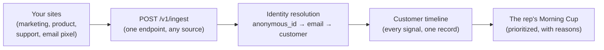

# Marketing Site PRD — CremaSales.com

> Spec for a separate Lovable build that produces the **marketing / acquisition** experience for CremaSales, deploys to the same Cloudflare Pages footprint as the app (or as a sibling under the same apex domain), and **dogfoods the CRM** by emitting every form submission as a real event into `/v1/ingest` on the live backend.
>
> Read alongside: [`../AGENTS.md`](../AGENTS.md) (brand, palette, voice), [`../REQUIREMENTS.md`](../REQUIREMENTS.md) (judges' brief), [`../scratch/jon/cremasales-prd.md`](../scratch/jon/cremasales-prd.md) (app PRD — design language is locked in code there), [`../scratch/pedram/new-guard.md`](../scratch/pedram/new-guard.md), [`../scratch/pedram/old-guard.md`](../scratch/pedram/old-guard.md), and [`../scratch/pedram/feedback.md`](../scratch/pedram/feedback.md) (voice-of-customer research that informs every claim on this site).

---

## 1. Why this site exists

CremaSales is a CRM that punches at the legacy giants by *removing* the most-hated CRM behavior — manual data entry, surveillance dashboards, dead pipelines — and replacing it with a shared-memory substrate, a prioritized action list, and a per-rep AI copilot. The product is opinionated; the marketing site has to be too.

The site has four jobs, in order:

1. **Articulate the problem and the wedges** in the first 5 seconds. Visitors who use CRMs daily should feel seen.
2. **Convert browse-curious visitors into leads** via two forms (email capture, demo request) that *land as real records inside the running CRM*.
3. **House the post-login surface for the browser extension** — download, install, connect, status.
4. **Be the second on-camera moment.** The cross-property ingest demo (curl → CRM record) is hard to top; the marketing site closing the loop (real form submission → real lead in CRM timeline) is the natural sequel.

The marketing site is **the third "property emitter"** in our ingest architecture, alongside the in-app event source and the email pixel. Submitting the demo form on this site is functionally identical to a marketing-attribution form fill in any real company. That's the dogfood.

---

## 2. Goals & non-goals

### 2.1 Goals

- Communicate the product positioning (anti-data-entry, prioritized actions, shared memory, AI copilot, ambient browser capture) in ~30 seconds of scrolling.
- Capture lead intent through two forms that feed `/v1/ingest` and become real CRM records.
- Provide a polished, on-brand surface for the **browser extension** behind login (download, connect, status, what-it-does, privacy).
- Look unmistakably **Crema**: warm palette, espresso typography, no shadcn-default-blue feel.
- Be deployable from Lovable to Cloudflare Pages alongside the app build.

### 2.2 Non-goals

- Pricing page with tiers / credit-card checkout. This is a contest demo; the "pricing" surface is a single "Request a demo" CTA.
- Full blog / changelog / docs site. A "What's new" strip is enough.
- Logged-in account management surface beyond the extension page — settings, billing, etc. live in the **app** (separate Lovable build at the same domain, under `/app/*` or `app.cremasales.com`).
- Custom auth on the marketing site. The "login" affordance is just a link to the app's existing login.

### 2.3 Anonymity (judging constraint — non-negotiable)

Blind judging applies to the marketing site too. **No team-identifying information anywhere** — no team name, no team avatars, no team-specific copy, no GitHub links to our personal accounts in the footer. The brand name **CremaSales** is fine; it's the product. Testimonial attributions must be generic ("Senior AE, Series B SaaS") and never name a real person we know.

---

## 3. Brand, voice, design

### 3.1 Brand contract (inherited verbatim from `AGENTS.md`)

- **Name:** Crema. **Product:** Crema Sales. **Domain:** `cremasales.com`.
- **Palette:**
  - **Crema** `#C9A36A` — primary CTAs, key accents
  - **Espresso** `#3B2A1E` — primary text, headers, dark surfaces
  - **Porcelain** `#FAF6F0` — page backgrounds
  - **Steam** `#E8DFD2` — borders, secondary surfaces
  - **Shot** `#7A4A2B` — hover/active, secondary CTAs
- **No pure white. No pure black. No cool grays. Everything is warm.** If a section reads "default shadcn light theme," it is wrong — push it warmer.
- **Voice:** warm, confident, a little playful. Coffee-shop-literate but never twee. We name things after espresso vocabulary where it reads naturally — never forced.

### 3.2 Design references (for Lovable's prompt context)

Reference the aesthetic of: **Linear**, **Vercel**, **Stripe (current site)**, **Attio**, **Arc Browser**, **Superhuman**. Reject the aesthetic of: legacy Salesforce, default shadcn templates, gradient-soup AI startup landing pages, anything that looks like "your CRM but with cards."

Concrete design rules:

- **Typography:** a single confident sans for UI/copy + a warm-grade serif accent for big headlines (e.g., `Inter` paired with `Fraunces` or `Source Serif`). Oversized hero headlines — at least 64px desktop.
- **Imagery:** abstract espresso-shot imagery (crema foam macro shots, latte-art swirls) as section dividers; **no stock-photo sales reps in headsets**. Product screenshots are illustrated/decorated, not raw screen-grabs.
- **Motion:** subtle. Section-entry fades, kanban cards that "pour" into stage on hover, a coffee-stream loader. Never bouncy.
- **Density:** generous whitespace; sections breathe; one idea per scroll. The product is opinionated about reducing noise — the site embodies that.
- **No dark mode toggle on v1.** The site has one mode. If we want to flex, the *app* gets dark mode; the marketing site stays warm porcelain.

### 3.3 Coffee-shop metaphor — how hard to lean

Default to **light-touch coffee voice**. Section labels can be coffee-themed where it earns the line ("The pour-over," "Pulled fresh every morning"), but body copy stays plain English. The product is a CRM — visitors are sales operators, not baristas — and they're scanning for "does this solve my problem" not "is this clever." The metaphor is the *flavor*, not the *meal*.

Verified examples of "earned" coffee language we can use:

- The daily AI summary card is called the **Morning Cup**.
- A saved-filter view is a **Pull**.
- The reward for closing a deal is a **coffee for closers** moment (Glengarry reference; visual celebration on deal-close).
- Otherwise, default to plain language.

---

## 4. Information architecture

### 4.1 Public routes

| Route | Purpose | Auth |
|---|---|---|
| `/` | Marketing home (the long-scroll story) | public |
| `/product` | Product features deep-dive | public |
| `/extension` | Browser extension marketing page (also linked from logged-in) | public |
| `/manifesto` | Long-form positioning / "why we built this" essay | public |
| `/changelog` | Recent shipped highlights (3-5 entries seeded) | public |
| `/privacy` | Privacy policy stub | public |
| `/terms` | Terms stub | public |

### 4.2 Authenticated routes (post-login, hosted on the marketing site)

| Route | Purpose |
|---|---|
| `/dashboard/extension` | Browser-extension control center: download, install steps, connection status, what's captured, privacy toggles |
| `/dashboard` | Redirects to the app (`/app/home` or `app.cremasales.com/home`) — placeholder if the app isn't reachable |

Everything else on a logged-in surface lives in the **app**, not the marketing site. The marketing site only hosts the extension dashboard because the extension is a marketing surface as much as a product surface.

### 4.3 Top-bar navigation

Persistent top bar, transparent over hero, solid-warm on scroll.

- Left: CremaSales wordmark (Espresso text + a small crema-gold dot)
- Center: `Product` · `Extension` · `Manifesto` · `Changelog`
- Right: `Log in` (text link) · `Request a demo` (Crema-gold pill button)

Mobile: hamburger that opens an Espresso-on-Porcelain drawer with the same items.

### 4.4 Footer

Minimal three-column footer.

- **Product:** Home · Product · Extension · Changelog
- **Company:** Manifesto · Privacy · Terms
- **Stay in the loop:** the email capture form (compact variant)

Footer bottom: copyright as `© 2026 CremaSales` (no team name, no person names) + a small crema-foam SVG. Optional: a single line in tiny type — *"Crema is the golden, caramel-colored foam on top of a properly pulled espresso shot."*

---

## 5. The marketing home page (`/`) — long scroll

Sections in scroll order. Each section is one screen tall on desktop, two on mobile. Every section can stand alone as a screenshot.

### 5.1 Section 1 — Hero

**Headline (Espresso, serif, oversized):**

> The CRM that updates itself.

**Subhead (Espresso, sans, ~24px):**

> Stop typing into fields. Your activity, your inbox, your calls — all of it flows in automatically. Reps close deals; the CRM keeps up.

**Primary CTA:** `Request a demo` (Crema-gold pill)
**Secondary CTA:** `See how it works ↓` (Espresso outlined, scrolls to §5.3)

**Visual (right side desktop, below copy mobile):** an animated product still — three small property icons (envelope, browser, support form) pouring streams of warm liquid into a single CRM record card. Loops on viewport entry. The card shows a live timeline being built.

**Trust strip below the hero:** a single line of placeholder logos with the caption *"Built by operators who've used every CRM you have."* No company logos in v1 — replace with five abstract-shape "company marks" we render. (Anonymity-safe.)

### 5.2 Section 2 — The problem (voice-of-customer)

**Headline:**

> Reps don't hate selling. They hate the CRM they sell into.

**Subhead:**

> We pulled the top complaints from r/sales, r/salesforce, and a stack of G2 reviews. The pattern is loud.

**Layout:** three-column "quote cards" — each card is a stylized verbatim or near-verbatim complaint from `feedback.md`, attributed generically.

Card 1:
> "Crushed my quota, but got chewed out for not logging WhatsApp chats. Are we closers or data entry monkeys?"
> *— Senior AE, fintech*

Card 2:
> "If it isn't in Salesforce, it didn't happen."
> *— Sales manager, B2B SaaS*

Card 3:
> "My clients don't use corporate email anymore. They text me. The CRM doesn't see any of it."
> *— Enterprise AE, infra*

Below the cards, a short closing line:

> Every legacy CRM treats the rep as the input device. We don't.

(All attributions are role + industry only. No names, no companies. Quotes adapted from `feedback.md` where verbatim is too long; preserve the spirit.)

### 5.3 Section 3 — The wedges (four cards)

**Headline:**

> Four things we did differently.

A 2×2 card grid (4-up on desktop, stacked on mobile). Each card has an icon, a wedge title, a one-line claim, a two-line explainer, and a small link to the deeper section.

**Card 1 — Auto-capture is the default, not the upsell.**
> Email, calendar, calls, web visits, support forms — all of it flows into one timeline per customer through a single ingest pipe. You never type the same thing twice.
> `→ See how ingest works`

**Card 2 — The home page is a verb, not a dashboard.**
> "Good morning. Here's who to call." One prioritized list, computed live from your activity stream and ticket SLAs. No widgets. No counters. No staring at a kanban wondering where to start.
> `→ See the Morning Cup`

**Card 3 — Your AI is a coworker, not a chatbot.**
> Every rep gets a copilot with the same data, the same API, the same view. Drafts emails, schedules follow-ups, watches your browser. You and your copilot can work the same record at the same time — both writes appear live.
> `→ Meet the copilot`

**Card 4 — Transparent automation. Always.**
> Every prioritized action shows *why* it's at the top. Every AI suggestion shows what it's looking at. No black boxes. No "trust us, the model said so."
> `→ See the receipts`

### 5.4 Section 4 — Product deep-dive (anchored)

A single long section split into anchored sub-blocks. Each block has a left text column (headline, body, list, secondary CTA) and a right product-still column (illustrated screen). Alternate sides every other block on desktop.

#### 5.4.1 The Morning Cup

> Your day, poured fresh.

Body: One prioritized list. Each row is a verb, a subject, and a reason. Sorted by a computed priority score combining open ticket SLAs, lead score, days since last contact, and ideal-customer flags. Sources are visible — if a row is AI-ranked, the chip says so. If it's deterministic, the chip is hidden.

Sample row in the still:
- **Call Sarah Chen at GreenLeaf Inc.** — *opened pricing 3× this week, ticket pending 4 days* — `Due 3:00 PM`

Secondary CTA: `Request a demo →`

#### 5.4.2 One timeline, every signal

> The CRM is downstream of your activity, not upstream.

Body: A single ingest endpoint accepts events from your marketing site, your product, your support inbox, an email pixel, or anything else that can POST JSON. Identity resolution merges anonymous web visits with the email signups they convert into, and stitches them onto the right customer record without the rep lifting a finger.

The still shows a timeline rendered on a customer's record with mixed event types — web visit, support form, in-app event, manual note, email open — each with its own source chip and timestamp.

Secondary CTA: `Watch the live ingest demo →` (anchor to §5.7)

#### 5.4.3 Pipelines that feel like a kanban, work like a database

> Drag-to-stage on top. SQL views underneath.

Body: The deal board is the obvious shape (five columns, drag-and-drop, value-per-column). What's underneath isn't obvious: every stage transition is an activity row, every probability is queryable, every saved view is a *Pull* you can share with your team.

Still: a kanban with deals being dragged across columns, with a faint "underlay" rendering the SQL view that backs the visual.

#### 5.4.4 Tickets in the record, where they belong

> Customer service is not a separate app.

Body: SLAs, escalations, history — inline on the customer record. A red chip when a ticket is past SLA. Reps see what support sees; support sees what reps see. One database, one view.

Still: a customer record with a "Tickets" tab open and one row showing an SLA warning chip.

### 5.5 Section 5 — The browser extension teaser

**Headline (large, serif):**

> Work in your browser. The CRM follows you.

**Subhead:**

> The Crema extension is your copilot's eyes and hands. Browse like you always do — LinkedIn, Gmail, your product, anywhere the work actually happens — and the CRM updates around you.

**Three-up feature row** (icons + one-liner):

- **Ambient capture.** The extension watches the tabs you tell it to and emits activity events to your CRM record. No copy-paste. No "log a call" modal.
- **Hand it the keys.** Tag a session as autonomous and your copilot picks up the cursor — research prospects, draft replies, pre-fill forms, build a hit list — while you're on a call or at lunch.
- **You're always in control.** A toolbar light shows when the extension is recording or driving. One click pauses everything. Per-site allow-list, no surprises.

**Visual:** an in-browser illustration showing a Gmail thread on the left and a CremaSales record updating in real time on the right, with a faint extension toolbar pulse.

**CTA:** `Install the extension` — for logged-out visitors this links to `/extension`, for logged-in visitors directly to `/dashboard/extension`.

(Full extension marketing page at `/extension`; full post-login control center at `/dashboard/extension`. See §7.)

### 5.6 Section 6 — Testimonials (three large cards)

**Headline:**

> Operators who switched.

Three large testimonial cards, full quotes (~30 words each), generic attribution. Drawn from `feedback.md` *positive* themes, reworded into the voice of someone who *moved* to CremaSales.

Card 1:
> "I used to spend the first hour of every day typing notes into Salesforce. Now I open Crema, see who to call, and start dialing. The CRM keeps itself."
> *— AE, mid-market SaaS*

Card 2:
> "The shared memory is the unlock. My replacement onboarded in a week because every conversation I'd ever had with the account was already on the record. No tribal knowledge lost."
> *— Sales lead, dev-tools startup*

Card 3:
> "The first AI feature in a CRM I actually trust. It tells me what to do and shows me why. No black box, no hallucinated 'next action.'"
> *— Head of revenue, fintech*

A small line below: *"Names and companies redacted for the contest build. Real testimonials will replace these post-launch."* Honest, judging-safe, doesn't oversell.

### 5.7 Section 7 — How it works (the live ingest demo, in writing)

**Headline:**

> Cross-property ingest, in plain English.

A three-step diagram (mermaid-rendered or hand-illustrated), explaining the flow:



Body copy below the diagram:

> Any property at your company that can speak HTTP can speak to CremaSales. One endpoint, one auth scheme, one identity graph. You don't need a CDP, a data team, or a Zapier subscription. You need a `curl` and an idea.

Tertiary CTA: `Read the manifesto →`

### 5.8 Section 8 — Email capture / "stay in the loop"

**Headline:**

> Want the long version?

**Subhead:**

> Drop your email. We'll send the design diary, the build notes, and an early invite when we open up.

**Form:** single-field email + submit. See §6.1 for full spec.

After submission, a Crema-gold success banner: *"You're on the list. Pour yourself something while you wait."* The banner stays for 3s, then collapses.

### 5.9 Section 9 — Demo request (large, second hero)

**Headline:**

> See it on your own data.

**Subhead:**

> Tell us a bit about your team and we'll get you in a guided session. Two reps, fifteen minutes, no slide deck.

**Form:** multi-field demo request. See §6.2 for full spec.

After submission: a fuller success state — *"You're in. Check your inbox in a minute, then look for yourself in our CRM — yes, really. We dogfood."* This last line is the on-camera moment — judges fill out the form, then we tab into the CRM and show them as a lead on the timeline.

### 5.10 Section 10 — Final CTA / footer transition

A single Espresso-on-Porcelain band with one line:

> **The CRM that updates itself. Pull a shot.**

Followed immediately by the footer.

---

## 6. Forms (dogfooding the CRM)

This is the highest-leverage section of the spec. Both forms emit real events into the production `/v1/ingest` endpoint on the running backend, so any judge who fills them out shows up as a real lead in the CRM seconds later.

### 6.1 Email-capture form

**Surface:** two locations — §5.8 inline, and the footer.

**Fields:**

| Field | Required | Validation |
|---|---|---|
| `email` | yes | RFC 5322 email |

**Submit behavior:**

1. Disable the button, show a small crema-foam spinner.
2. POST to `/v1/ingest` with the payload below.
3. On 2xx, replace the form with a success banner (§5.8 copy).
4. On any non-2xx, render a small inline error: *"That didn't pour cleanly. Try again in a sec."* No detail, no stack traces.

**Ingest payload (email signup):**

```json
{
  "type": "track",
  "event": "email_signup",
  "identity": {
    "email": "{{email}}",
    "anonymous_id": "{{anonymous_id_from_cookie}}"
  },
  "properties": {
    "source": "marketing_site",
    "form": "email_capture",
    "surface": "footer | section_8",
    "page": "{{current_path}}",
    "referrer": "{{document.referrer}}",
    "utm": { "source": "...", "medium": "...", "campaign": "..." }
  },
  "timestamp": "{{ISO timestamp}}",
  "source": "marketing_site"
}
```

**Auth:** the marketing site holds a `MARKETING_INGEST_WRITE_KEY` env var, sent as `Authorization: Bearer ${key}`. Key is per-property; rotatable.

**Anonymous-id cookie:** the marketing site sets `crema_anon=<uuid>` on first page view, lasts 12 months. Every ingest payload includes it. Identity resolution will merge anonymous events with the first form fill that supplies an email.

### 6.2 Demo-request form

**Surface:** §5.9 inline. Also reachable from every `Request a demo` CTA in the top bar — those scroll to the section.

**Fields:**

| Field | Required | Validation / control |
|---|---|---|
| `full_name` | yes | non-empty |
| `work_email` | yes | RFC 5322 email; *bonus*: warn if it's a free-mail domain ("a work email gets you a faster response") but don't block |
| `company` | yes | non-empty |
| `role` | yes | dropdown: AE · Sales Manager · RevOps · Founder · Other |
| `team_size` | yes | dropdown: 1 · 2-5 · 6-20 · 20-100 · 100+ |
| `current_crm` | no | dropdown: Salesforce · HubSpot · Pipedrive · Zoho · Attio · Other · None |
| `pain_point` | no | textarea (3 lines) — placeholder: "What's the one thing your current CRM is making impossible?" |
| `consent_marketing` | yes | checkbox: "Email me about Crema launches" — default-on |

**Submit behavior:**

1. Disable submit, show crema-foam spinner.
2. POST to `/v1/ingest` with the payload below.
3. On 2xx, swap the form for the §5.9 success state.
4. On non-2xx, inline error: *"We couldn't pour that one. Try again or email us at hello@cremasales.com."*

**Ingest payload (demo request):**

```json
{
  "type": "identify",
  "identity": {
    "email": "{{work_email}}",
    "anonymous_id": "{{anonymous_id_from_cookie}}"
  },
  "traits": {
    "name": "{{full_name}}",
    "company": "{{company}}",
    "role": "{{role}}",
    "team_size": "{{team_size}}",
    "current_crm": "{{current_crm}}"
  },
  "properties": {
    "source": "marketing_site",
    "form": "demo_request",
    "pain_point": "{{pain_point}}",
    "consent_marketing": true,
    "page": "{{current_path}}",
    "referrer": "{{document.referrer}}",
    "utm": { "source": "...", "medium": "...", "campaign": "..." }
  },
  "timestamp": "{{ISO timestamp}}",
  "source": "marketing_site"
}
```

After the `identify` call, immediately fire a second `track` event:

```json
{
  "type": "track",
  "event": "demo_requested",
  "identity": { "email": "{{work_email}}" },
  "properties": { "form": "demo_request", "page": "{{current_path}}" },
  "timestamp": "{{ISO timestamp}}",
  "source": "marketing_site"
}
```

This split (identify → track) is intentional: it mirrors how real Segment-shaped CDPs work and lets the backend's identity resolution stitch the anonymous browsing → identified lead → action-on-record sequence into one timeline.

### 6.3 Server-side contract (what the backend does with these)

Documented here so Lovable's API integration matches the existing backend contract. **Lovable should not implement the backend behavior** — only POST the payloads above.

- `/v1/ingest` is on the same domain as the app (`cremasales.com/v1/ingest`) — no CORS gymnastics.
- The backend writes one `activities` row per event, runs identity resolution against KV, and upserts the customer record's `last_seen`, `lead_score`, and (on demo requests) creates a *lead* record with `source=marketing_site, stage=new`.
- Every submission also fires our outbound webhook fan-out (Slack notify, optional email), but Lovable doesn't see any of that.
- The cron-driven Morning Cup picks up the new lead on its next pass. If a judge fills the form during the demo, we can refresh the rep's Morning Cup live and watch the lead surface in priority order.

### 6.4 Anti-spam & abuse

- **Honeypot field** `subject` — hidden via CSS, populated by bots, rejected on the server.
- **Time-to-submit floor** — track form-render timestamp, reject submissions under 800ms.
- **Cloudflare Turnstile** on the demo-request form (not the email form). Site key + secret in env vars.
- **No third-party tracking pixels.** No GA, no Meta pixel, no LinkedIn Insight. We dogfood our own pixel and that's it.

---

## 7. Browser extension surfaces

The extension has two marketing surfaces and one post-login control center. They share copy and visual elements; only the audience and CTAs differ.

### 7.1 Public extension page (`/extension`)

A one-screen-tall hero plus three deeper sections. Logged-out audience.

**Hero:**

> Your CRM lives in your browser now.

**Subhead:**

> The Crema extension captures every meaningful interaction you have in the browser — and, when you ask it to, takes the cursor for you.

CTA: `Install the extension` (links to Chrome Web Store; greyed with *"Coming soon to Firefox & Edge"* below).

**Section A — Ambient capture.** Animated still of a Gmail thread on the left, CremaSales timeline on the right populating as the user reads. Copy: *"You read an email; the CRM logs it. You take a call on Google Meet; the CRM logs it. You open a LinkedIn profile; the CRM enriches the record. Nothing to copy, nothing to paste."*

**Section B — Autonomous mode.** Copy: *"Hand your copilot the cursor. It researches prospects, drafts replies, fills forms, builds hit lists — while you're on a call, in a meeting, or at lunch. Every action lands on the audit trail. You stay in command."* Still: a browser window with a faint extension overlay showing the copilot driving — cursor trail, action log on the right.

**Section C — Privacy & control.** Copy: *"You decide which sites the extension watches. You decide when autonomous mode is on. A toolbar light shows recording status; one click pauses everything. The extension never sends data anywhere except your own CRM."* Three sub-bullets:

- Per-site allow-list
- Manual pause from the toolbar
- All traffic flows to your CremaSales tenant; we never see your data

**Bottom CTA:** `Get a demo` (links to §5.9 on home).

### 7.2 Post-login extension dashboard (`/dashboard/extension`)

The authenticated control center. This is the surface the user asked for: "Once they log in we're also going to want a section to house the browser extension."

**Auth:** requires a Crema session cookie set by the app's login flow. If unauthenticated, redirect to the app's login with `?next=/dashboard/extension`.

**Layout:** single-column, card-stacked. Lots of whitespace; this isn't a settings hellscape.

#### 7.2.1 Connection status card (top)

A large status card with a single state indicator:

| State | Label | Visual |
|---|---|---|
| `not_installed` | "Extension not installed" | Steam-gray dot, install CTA |
| `installed_disconnected` | "Installed — connect to start capturing" | Shot-brown dot, connect CTA |
| `connected_idle` | "Connected, listening" | Crema-gold dot, soft pulse |
| `connected_recording` | "Recording activity on {{site}}" | Crema-gold dot, fast pulse |
| `connected_driving` | "Autonomous mode active on {{site}}" | Shot-brown ring around Crema dot, slow pulse |
| `paused` | "Paused by you" | Espresso outlined dot, resume CTA |

Status is fetched on page load from `GET /v1/me/extension/status` (an existing API; the marketing surface is read-only here).

Below the dot: last 3 captured events, each as a one-line summary (`Read email from sarah@greenleaf.com — 2m ago`). Links to the matching customer record in the app.

#### 7.2.2 Install / update card

If state is `not_installed` or extension version is below current:

- A Chrome Web Store install button (`chrome://extensions/?id=...` deep link, with web-store fallback).
- *Manual install (sideload)* expandable section with three-step instructions for the unsigned-build path during the contest: unzip, open `chrome://extensions`, Load Unpacked, choose folder. (The contest build is a sideloaded extension; the Web Store entry comes later. Be explicit about this state.)
- Firefox/Edge: "Coming soon" badge, no CTA.

#### 7.2.3 What's being captured card

Two columns:

- **Sites I'm watching** — toggle list of allowed sites. Defaults: `mail.google.com`, `linkedin.com`, `calendar.google.com`. Add custom via input. Wildcards supported (`*.greenleaf.com`).
- **What I capture** — toggleable categories: page views, email opens (Gmail), calendar invites, LinkedIn profile visits, in-product clicks. All on by default.

Below: a small "Privacy" disclosure block:

> Captured events are sent to your CremaSales tenant only. Crema does not collect, retain, or share extension data outside your account. [Read the policy →]

#### 7.2.4 Autonomous mode card

A separate card. Headline: *"Hand over the cursor."*

Body: explains autonomous mode in 2-3 sentences. Toggle: *"Allow my copilot to drive my browser when I'm idle ≥ N minutes."* N defaults to 10 min; slider 5-60.

Below the toggle, a recent-autonomous-actions log: last 5 actions the copilot took, with timestamps and the option to revert each. Examples:

- *Researched Sarah Chen on LinkedIn — saved 4 facts to her record — 9:14am*
- *Drafted a follow-up email for the GreenLeaf deal — pending your review — 9:11am*

#### 7.2.5 Disconnect / uninstall card (bottom, low-emphasis)

A small section at the bottom: `Disconnect this device` and a link to "How to uninstall the extension." Honest, friction-free, judging-trust signal.

### 7.3 Backend contract for the dashboard

The dashboard reads from these endpoints on the existing backend (no new API surface needed on the marketing site itself):

- `GET /v1/me/extension/status` — returns connection state + last captured events
- `GET /v1/me/extension/sites` — returns the allow-list
- `PATCH /v1/me/extension/sites` — update the allow-list
- `GET /v1/me/extension/autonomous` — autonomous-mode config
- `PATCH /v1/me/extension/autonomous` — update autonomous config
- `POST /v1/me/extension/disconnect` — revoke the extension's session token

If any of these endpoints are unavailable at build time, the dashboard renders skeleton states with a one-line "Connecting to your account..." message — never a stack trace.

---

## 8. The manifesto page (`/manifesto`)

A long-form essay, single column, max-width 720px. Written for the operator reader, not the procurement reader. Tone: confident, slightly contrarian, never preachy.

Suggested structure (each H2 a beat):

1. **The CRM was supposed to help you sell.** It became surveillance.
2. **Why every "AI CRM" feels the same.** They bolted an LLM onto the existing object model. We built the object model around the assumption that AI is the default writer, not the rep.
3. **Auto-capture is not a feature. It's an architecture.** Every signal lives in one timeline. Reps consume; agents produce.
4. **Prioritization with receipts.** Why we show the math behind every "do this next."
5. **The copilot is a coworker, not a chatbot.** Shared view, shared API, shared writes.
6. **The browser is the work surface.** Why we ship an extension, and what it captures (and doesn't).
7. **A CRM that pours itself.** Final beat. CTA back to demo request.

Lovable should write this as **placeholder copy** with the structure intact; we'll polish the prose in a content pass post-build. Use the verbatim-quote material from `feedback.md` for color.

---

## 9. Changelog (`/changelog`)

A single column of 3-5 entries, reverse-chronological. Each entry has a date, a title, a paragraph, and an optional image. Seeded with placeholder entries that read as real shipped features. Examples:

- **2026-05-18 — Morning Cup, generally available.** Every rep's home page is now the prioritized action list, computed live from your activity stream and ticket SLAs. The list explains *why* each row is at the top — no more "trust the model."
- **2026-05-15 — One ingest pipe, any property.** `/v1/ingest` accepts events from any property at your company. Send a `track`, send an `identify`, send a `page`. We resolve identity, write the timeline, fan out webhooks. One endpoint, one auth scheme.
- **2026-05-10 — The Crema browser extension is here.** Capture browsing activity. Hand your copilot the cursor. Read the [extension page](/extension).

Format keeps the rest of the site feeling alive without us having to maintain real content.

---

## 10. Dogfooding the CRM — how a judge experiences the loop

This is the highest-stakes on-camera moment after the curl-ingest demo. The sequence:

1. Open the marketing site on the projector. Scroll through the hero, the wedges, a screenshot or two.
2. Land on §5.9 (demo request form). Fill it out as a fictional persona — name "Pat Operator," email `pat@example.com`, company "ExampleCo."
3. Submit. Success state appears.
4. Tab to the CremaSales app, logged in as a sales rep.
5. The new lead "Pat Operator at ExampleCo" appears in:
   - The Customers list (or Leads list, depending on auto-conversion)
   - The Morning Cup's prioritized action list within 1-2 seconds
   - The customer record's timeline, with the `email_signup` and `demo_requested` activities back-to-back
6. Click into Pat's record. Show the rich timeline: the anonymous browsing that preceded the form, the form fill, the identify event stitching them together.

For this to land cleanly, the marketing site **must**:

- Send the `anonymous_id` cookie on every page-view as a `page` event to `/v1/ingest`, *before* the form fill. That way the timeline shows browsing → form, not just form.
- Send the `identify` and `demo_requested` events in that order on submission.
- Render its own success state in under 1 second so the demo doesn't stutter on screen.

---

## 11. Tech requirements

### 11.1 Stack

- **Framework:** Lovable's React/TypeScript/Tailwind output.
- **Routing:** React Router v6.
- **State for forms:** local component state; no global store needed.
- **Auth:** none of its own. Reads the existing Crema session cookie (`crema_session`) to determine logged-in state for the extension dashboard; if missing or invalid, redirect to `/app/login`.
- **Analytics:** dogfooded only — `/v1/ingest` page events on every route navigation.

### 11.2 Env vars

| Var | Purpose |
|---|---|
| `INGEST_ENDPOINT_URL` | `https://cremasales.com/v1/ingest` (prod) or `http://localhost:8787/v1/ingest` (dev) |
| `MARKETING_INGEST_WRITE_KEY` | Bearer token for `/v1/ingest`; per-property HMAC |
| `TURNSTILE_SITE_KEY` | Cloudflare Turnstile site key |
| `APP_BASE_URL` | `https://cremasales.com/app` or `https://app.cremasales.com` — where login + dashboard links go |

### 11.3 Deploy target

Cloudflare Pages, sibling to the app. Two acceptable topologies — pick at deploy time based on whichever Wrangler routing is simpler:

- **Path-based:** marketing at `cremasales.com/*`, app at `cremasales.com/app/*`.
- **Subdomain:** marketing at `cremasales.com`, app at `app.cremasales.com`.

The PRD assumes **path-based** for copy ("Log in" → `/app/login`). If we go subdomain, swap accordingly — it's a single env var.

### 11.4 Performance budget

- Hero LCP < 1.5s on a clean cache (warm-porcelain background, no hero video).
- Total JS payload < 200kb gzipped for the marketing routes (the dashboard route can be heavier).
- All images served as AVIF with WebP fallback.
- No third-party scripts in v1 (no GA, no chat widget).

### 11.5 Accessibility

- All forms have visible labels + `aria-describedby` for help text.
- Focus rings use the Crema-gold (`#C9A36A`) for visibility on Porcelain.
- All animations respect `prefers-reduced-motion`.
- All copy passes WCAG AA contrast on its background; Espresso on Porcelain (≈ 11:1) comfortably passes.

### 11.6 SEO & metadata

- Page titles: `CremaSales — The CRM that updates itself` (home) and route-specific elsewhere.
- Open Graph: a single hero card image (illustrated coffee + CRM record motif). No team identifying info.
- Twitter card: `summary_large_image`.
- `robots.txt`: allow all; we want to be indexed.
- Sitemap: auto-generated from routes.

---

## 12. Anonymity sweep checklist

Before deploy, the marketing site must pass this checklist. Every `❌` is a blocking bug.

- [ ] No team name (`Ctrl-Alt-Elite`, `control alt elite`, etc.) appears in any rendered text, HTML comment, alt text, or filename.
- [ ] No team-member GitHub handles or personal links anywhere.
- [ ] Footer copyright reads `© 2026 CremaSales` only.
- [ ] All testimonials use role + industry attribution, no names, no companies.
- [ ] Page titles, meta descriptions, OG cards contain no identifying info.
- [ ] The author of any HTML/CSS comments is generic (`Crema design team` or omitted).

---

## 13. Build phasing (suggested order for Lovable)

If we're racing the clock (we are), build in this order. Each phase is independently deployable.

| Phase | Surface | Why this order |
|---|---|---|
| 1 | Top bar + footer + hero (§5.1) + email capture form working end-to-end | First demoable surface; proves the ingest plumbing |
| 2 | §5.2 problem + §5.3 wedges + §5.4 product deep-dive | The recognition pass — judges see "this is a serious marketing site" |
| 3 | §5.9 demo request form + §10 dogfood loop | The highest-leverage demo moment |
| 4 | §5.5 extension teaser + §5.6 testimonials + §5.7 how-it-works | Density + trust signals |
| 5 | `/extension` public page + `/dashboard/extension` post-login | The user-requested extension surface |
| 6 | `/manifesto`, `/changelog`, `/privacy`, `/terms` | Long tail — only if time |

Anything past phase 3 is gravy. Phase 1 alone, with the dogfood loop working, is a memorable demo.

---

## 14. Open questions for the team

1. **Path-based vs subdomain.** Does the marketing site live at `cremasales.com/*` (app under `/app/*`) or as a separate `cremasales.com` apex with the app on `app.cremasales.com`? This affects link copy throughout; happy to default to path-based.
2. **Turnstile or not.** Cloudflare Turnstile adds ~30 minutes of integration. Worth it for the demo-request form, or skip for v1 and rely on honeypot only?
3. **Testimonials voice.** Hold the stylized-anonymous testimonials in §5.6 as drafted, or do we want them written *as if* from the team's network (still anonymous, but cribbing real people's actual quotes from social)?
4. **Manifesto depth.** Ship the manifesto as placeholder structure only, or draft the full prose now (adds ~1-2 hours)?
5. **Extension page in v1.** Confirm the post-login extension dashboard is in scope for the marketing site build — it could just as easily live inside the app. Putting it on the marketing site makes the install/install-status flow more discoverable; putting it in the app keeps surfaces clean.
