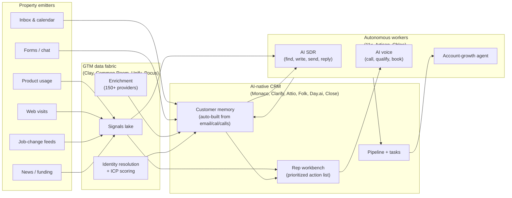

# New Guard CRM / GTM Deep Dive

> Research note for the Ep. 3 build. Sources captured live via `interceptor` on 2026-05-18, with WebSearch fills where the site was client-rendered to empty (Monaco, Clarify). Cross-referenced with our brief in [`REQUIREMENTS.md`](../../REQUIREMENTS.md), the build plan in [`01-crm-assessment.md`](./01-crm-assessment.md), and the old-guard counterpart at [`old-guard.md`](./old-guard.md).

## TL;DR

The "new guard" is **not** "Salesforce with AI buttons." It's a re-decomposition of the GTM stack along a different axis:

```
old guard axis:   record types → modules (sales, marketing, service, commerce)
new guard axis:   data → reasoning → action, with humans pulled in only at handoffs
```

In practice, the new guard splits into three architectural camps, and most product positioning is just a question of *which camp* and *how aggressively autonomous*:

1. **AI-native CRMs that replace the system of record** (Monaco, Clarify, Attio, Folk, Day.ai, Close). The pitch: stop making reps maintain the database; let agents do it from email, calendar, and call data.
2. **GTM data + workflow fabric that sits *next to* the CRM** (Clay, Common Room, Unify, Pocus). The pitch: your CRM is a passive database; we'll bring it intent, signals, and orchestration.
3. **Autonomous outbound workers** (11x, Artisan, and "Chloe" inside Close). The pitch: don't hire SDRs; hire one of our digital workers.

Affinity is a fourth, narrow camp — **relationship-intelligence CRM for private capital** — that's old-guard-shaped but new-guard-priced.

For our 6-hour build, what's worth borrowing is the **shape of the data pipeline**, the **autonomy language** in the UX, and the **"signals as first-class objects"** idea. What's not worth borrowing is the bet that judges will trust an autonomous agent in 6 hours of work.

## The three architectural patterns, drawn



Three things to notice:

- **Memory is the new system of record.** "Customer memory" (Day.ai's framing), "context" (Common Room's "Context360"), "buyer intelligence" (universal) — they all mean the same thing: a continuously updated, identity-resolved snapshot of each buyer, built from email/calendar/calls/product/signals *automatically*. Reps don't type into fields anymore.
- **Signals are first-class objects, not properties of contacts.** Job changes, funding rounds, web visits, product events, news mentions live in their own time-ordered store and trigger workflows independently. Our `activities` table is the same shape.
- **Agents are output-only.** Almost no one ships "an AI inside the CRM that helps reps type faster." They ship agents that *act*: book meetings, draft replies, run sequences, qualify leads, update fields. The verbs are different.

## Vendor profiles

### Camp 1: AI-native CRMs (replace system of record)

#### Monaco — $35M, ex-Founders Fund

> "AI-native CRM with agentic workflows, auto-pipeline management, proactive deal movement." Targets seed→Series B replacing Salesforce early.

- **Wedge**: "Stop having reps maintain the database." Auto-logs email, call, meeting; manages pipeline with minimal input; recommends next actions.
- **Distinctive**: ships *humans-in-the-loop* — actual experienced salespeople supervise the AI's outbound work, sold as a service. (TechCrunch coverage Feb 2026.)
- **For us**: the auto-logging is the headline feature. We get that for free via the same `/v1/ingest` pipe — *if* we also wire email and calendar pixels. Probably out of scope for 6h, but the demo line is reusable: "the CRM is a *consequence* of the activity stream, not the cause."

#### Clarify — $15M, Seattle

> "The autonomous CRM for founder-led startups." [clarify.ai](https://www.clarify.ai/)

- **Wedge**: "Updates fields, manages pipeline, and answers questions — so you can close more deals." The CRM itself is free; you pay only when AI agents successfully complete tasks (success-based billing).
- **Distinctive**: ambient intelligence (calendar/email monitoring), autonomous pipeline building (AI agents find leads, qualify, book demos), credit-based pricing with unlimited seats.
- **For us**: the "success-based billing" framing is a marketing primitive, not a product one. Skip. But the **field-update suggestion UI** (AI proposes an update, rep confirms) is a great pattern for our build — it lets us do "AI everywhere" cheaply without committing to autonomy we can't prove in 6h.

#### Attio — the polished AI CRM

> "The intelligent system that never sleeps. Picks up leads at 2am. Catches renewals before they slip. Hands you the answer before you ask." [attio.com](https://attio.com/)

- **Wedge**: collaborative CRM with a *flexible data model* (custom objects, custom attributes — like a relational Notion) + AI enrichment. They ship a **Developer Platform with MCP** for agentic integrations.
- **Distinctive**: workflows-as-code feel; explicit MCP server; sub-50ms latency; AI fields that auto-research stakeholders, ARR, funding. Visible quotes from Railway, Flatfile, Snackpass, Modal — the dev-tools crowd.
- **For us**: Attio's **field-level AI** ("AI: did the company raise any funds recently? → $25M Series A") is the *most stealable* pattern in the new guard. It's just a field that runs an LLM call on insert. Two-line implementation. We can ship one of these as our hero demo moment ("watch the deal stage auto-suggest from the call transcript").

#### Folk — the lightweight relationship CRM

> "The CRM that works for your team." Founder-network and small-team focus. [folk.app](https://folk.app/)

- **Wedge**: simple data model + a Chrome extension (folkX) that pulls contacts off LinkedIn + AI Assistants that do sales research, generate contextual drafts, automate sequences.
- **Distinctive**: 6000+ integrations; sub-second contact capture; pipelines as a layer on top of contacts (not the other way around).
- **For us**: not architecturally different — but Folk's UX of "every record is a contact card with conversations stitched in" is a clean opinion. Their onboarding ("how many teammates?" first question) is good to copy for our cold-open judge moment.

#### Day.ai — the customer memory thesis, distilled

> "Customer memory for agents. Day AI captures every call, email, and meeting automatically. Your agents know what happened, what was promised, and what to do next." [day.ai](https://day.ai/)

- **Wedge**: the *most narrowly focused* AI-native CRM. Everything is one idea: a shared, team-wide memory across all customer touchpoints, queryable by agents.
- **Distinctive**: explicitly positions itself as the **substrate** other agents (the team's, third-party) run on. Has a public MCP endpoint. Quote: "Most AI tools are single-player. They help one person at a time. They don't share what they know."
- **For us**: this is the cleanest articulation of the design philosophy our `/v1/ingest` pipe also embodies — the **CRM is a shared memory feeding many consumers**, not a form-entry app. We should *write* about our app in these terms in any demo copy.

#### Close — old-guard-shaped, new-guard-acting

> "This CRM calls your leads for you." Built around its product **Chloe**. [close.com](https://close.com/)

- **Wedge**: SMB outbound CRM that auto-calls inbound leads within minutes, transcribes, summarizes, books meetings.
- **Distinctive**: deepest *voice* integration in the new guard. REST API, webhooks, **MCP server**. Brags about replacing Salesforce at $100K of tech cost savings.
- **For us**: Close validates that **a clean SMB-shaped CRM with one big AI agent attached** is a credible product story. That's basically our brief.

### Camp 2: GTM data + workflow fabric

#### Clay — the "spreadsheet for GTM"

> "Go to market with unique data — and the ability to act on it. Bring AI agents, enrichment, and intent data together." [clay.com](https://www.clay.com/)

- **Wedge**: the orchestration layer. 150+ data providers, "Claygents" (named AI agents), conditional workflows, AI formatting, destinations to push to CRM/email/etc.
- **Distinctive**: spreadsheet-shaped (Airtable-like) but where every cell can be an enrichment, an AI agent call, or a conditional step. 300K+ teams claimed; Anthropic uses it (per case study on their site).
- **For us**: Clay is **the closest reference architecture for our identity-resolution + enrichment pipeline**. The mental model — `signals + enrichment + AI → push to CRM/email` — is exactly what we're building, except we host the CRM too. If we built one thing that looked Clay-shaped in our app, it would be the **ingest event timeline view** (signals coming in, identity-resolved to a customer, with an "enrich" button on each row).

#### Common Room — buyer intelligence + signals

> "Complete buyer intelligence. Real pipeline impact." [commonroom.io](https://www.commonroom.io/)

- **Wedge**: unifies CRM + product + marketing + engagement signals into "Context360," a continuously-resolved buyer view; ships AI agents ("RoomieAI") that act on it; "Revenue Control Plane" for ops to orchestrate plays without engineering.
- **Distinctive**: built for **PLG and dev-tools companies** (GitHub activity, product usage, community signals). Strong contrast with Clay positioning: Clay is for ops who build, Common Room is for sellers who consume.
- **For us**: their feature framing ("Know who's in market → Act on it automatically → Run it at scale") is a perfect three-act demo narrative. Reusable.

#### Unify — signal-driven outbound

> "The future of outbound. Intent data and outbound action were meant to be together." [unifygtm.com](https://www.unifygtm.com/)

- **Wedge**: outbound execution platform fed by intent signals (web traffic, product usage, job changes, AI signals). One-pane experience for "data → engagement → plays."
- **Distinctive**: focused narrower than Clay — explicitly **outbound** as the verb, not enrichment-in-general. Customer logos all AI-native (Perplexity, Cursor).
- **For us**: not directly relevant to the build (we're not building outbound) but the *language* ("plays," "signals," "outbound system of action") is worth borrowing for our internal vocabulary.

#### Pocus — opinionated prioritization

> "Make outbound feel like inbound — with AI. Pocus AI tells reps where to focus and what to do next." [pocus.com](https://www.pocus.com/) (joining Apollo)

- **Wedge**: takes the chaos of N signal sources + CRM and surfaces *opinionated* "do this next" recommendations.
- **Distinctive**: explicitly anti-"more signals" — "while your reps guess what to do next, Pocus AI tells them exactly which accounts to work, who to call, and what to say." Captures everything, recommends contacts + messages.
- **For us**: **Pocus is the closest spiritual match to our MUST #2** (prioritized action list). They differentiate on having *opinions* vs. their competitors' "here's a feed, you decide." We should adopt that posture. Our action list shows *one* thing per row with a clear verb: "Call Sarah Chen at GreenLeaf — opened pricing page 3× this week." Not a feed of signals.

### Camp 3: Autonomous outbound workers

#### 11x — Alice + Julian

> "Digital workers, human results." Alice runs prospecting/outreach; Julian runs voice calls in natural language. [11x.ai](https://www.11x.ai/)

- **Wedge**: replace SDR headcount with an always-on digital worker — find leads (50+ data sources), enrich, personalize, multi-channel (email, social, phone, SMS), handle replies.
- **Distinctive**: voice agent ("Julian") that adapts mid-call. Customers report 1.5× qualified meetings.
- **For us**: not directly applicable. But the "named digital worker" framing (Alice, Julian, Ava, Chloe — every new-guard outbound product anthropomorphizes) is a tell: the **agent-as-named-coworker UX is the new-guard convention**. If we ship an agentic stretch goal, give it a name.

#### Artisan — Ava

> "Hire Ava. The autonomous AI BDR." [artisan.co](https://www.artisan.co/)

- **Wedge**: end-to-end outbound on autopilot. 250M+ B2B contacts, 22+ data sources, intent-driven prioritization, multi-channel sequences, autonomous reply handling.
- **Distinctive**: marketing leans hard on **A/Z testing** (dozens of message variations running simultaneously, traffic shifting to winners). Trust signal: Jason Lemkin / SaaStr quote.
- **For us**: not architecturally interesting for our build. Mentioned for completeness.

### Camp 4: Relationship intelligence (Affinity)

> "The CRM for private capital. Your next deal is in your network." [affinity.co](https://www.affinity.co/)

- **Wedge**: deal flow CRM that auto-captures emails/calendar/meetings + maps the team's collective relationship network ("who on your team knows decision-makers at target companies").
- **Distinctive**: PE/VC/IB focus. The graph is the product.
- **For us**: not in scope, but the underlying tech (auto-capture into a unified contact graph) is the same pattern as Day.ai/Monaco. Mentioned because it's an old, **profitable** company doing this and proves out the auto-capture market.

## What the new guard agrees on (the new table stakes)

If "old guard table stakes" is the union of features every legacy vendor ships, "new guard table stakes" is the **set of design choices every AI-native vendor makes**. Different list:

1. **Auto-capture > manual entry**. The headline UX promise across Monaco, Clarify, Attio, Folk, Day.ai, Close, Affinity. Reps don't type into fields; the system reads email/calendar/calls and proposes updates.
2. **Customer memory as a queryable substrate**. Day.ai is the purest version, but everyone has it: a continuously-updated, identity-resolved view of every buyer.
3. **Signals as first-class objects** with timestamps, ranked, filterable, triggerable. Not properties on a contact.
4. **Workflows as data flows**, not screens. Trigger → enrich → branch → act. Closer to dbt or n8n than to Salesforce Flow.
5. **MCP / open API as a top-line feature.** Attio, Close, Day.ai, Common Room (Spark), Clay all advertise MCP. The implicit pitch: "your agents can talk to ours." This is genuinely new in the last year.
6. **Named, anthropomorphic agents.** Roomie, Alice, Julian, Ava, Chloe. Even Attio personalizes their workflow engine in copy. The framing is "hiring," not "configuring."
7. **A "prioritized next action" view as the rep home page**, not a kanban. Pocus most explicit; Day.ai, Monaco, Clarify all built around it.
8. **Success-based or usage-based pricing** more often than seat-based. Clarify is the clearest: you pay when an agent completes a task.

## Mapping to our requirements

| Our requirement | New guard pattern | What we ship |
|---|---|---|
| **MUST 1**: rep login → assigned customers + leads | Universal — "rep home." Day.ai's "good morning Alex" header, Attio's home dashboard. | Login → rep home with greeting + tabs: action list, customers, deals. |
| **MUST 2**: prioritized action list | **The new-guard hero feature**. Pocus has the cleanest take. | Our SQL view ranking actions. One column. Verbs first. (See `01-crm-assessment.md`.) |
| **MUST 3**: CRUD customer records | Universal but de-emphasized. Day.ai/Monaco let agents do it. | Cheap forms; bonus: an AI-suggested-edit chip next to a field (Attio pattern, Clarify pattern). |
| **MUST 4**: cross-property activity ingestion | **The architectural core of the new guard**. Clay, Common Room, Day.ai all built on this. | Our `/v1/ingest` + identity resolution + timeline (already designed). The three property simulators are exactly what new guard would ship as a demo. |
| **Stretch: webhook-ready** | Universal — all new-guard vendors lead with API + MCP. | Cloudflare Queues fan-out. Plus advertise MCP if we have 30 min. |
| **Stretch: agentic daily report** | **This is the new guard's identity**. | A cron Worker that generates per-rep "your day" summary from activities + open tasks + ticket SLAs. Render as the top dashboard card. Give it a name. |

## What's worth stealing (concretely)

1. **Rename the home page from "Dashboard" to something verb-led.** "Good morning, Alex. Here's what to do today." (Day.ai's exact framing.) The greeting + computed action list above the fold is the demo opener.
2. **Field-level AI suggestions** (Attio pattern). On the customer record, next to an editable field, a chip: "AI suggests: $25M Series A" sourced from the last activity. One LLM call per field on edit. Two hours of work, very high demo wattage.
3. **Signals timeline on every record**, with icons per source (email, web, product, support form). Click a row → see raw event payload in a modal. **This makes MUST #4 visible**, not just functional.
4. **An "AI:" chip prefix on auto-suggested rows in the action list.** Subtle visual mark that says "this came from the system, not a person." New guard universally uses this; old guard doesn't.
5. **MCP endpoint that exposes our customer records as a tool**, even if it's just an artifact for the demo. Day.ai/Attio/Close/Common Room all advertise it; Cloudflare Workers can host an MCP server in a few dozen lines. **30-60 min stretch, very on-brand.**
6. **Give the agentic stretch a name.** "Ava," "Chloe," "Roomie" are all taken; pick something. Render its avatar in the top-bar. The thing it does is a 90-second cron + LLM prompt; the *naming* is what reads as new-guard.
7. **The "drop signals in and watch the timeline update" demo moment.** Common Room, Clay, Day.ai all do versions of this on camera. We have it for free with our three simulators. Just make sure the timeline auto-refreshes (SSE or 2s poll) so the live update is visible.

## What to consciously *not* copy

- **Autonomous outbound (11x, Artisan)**. Building Alice/Julian/Ava in 6 hours is not realistic and the brief doesn't ask. We're a CRM, not an SDR replacement.
- **A real 150-provider enrichment fabric (Clay)**. We can fake "enrichment" with a single LLM call against the company domain if we want a demo moment, but no real provider integrations.
- **Voice (Close/11x Julian)**. Phone integration is a multi-day build (Twilio + transcription + signaling). Out of scope.
- **A flexible custom-object data model (Attio)**. The brief gives us a fixed schema. Ship that schema, not an editor.
- **The "named agent" UX everywhere**. Pick one place to lean in — probably the daily-summary stretch — and don't anthropomorphize the rest of the app. Doing it everywhere feels like a costume.

## The hardest thing the new guard does well that we should at least gesture at

**Identity resolution at scale.** Common Room's "Context360" and Clay's contact graph are real engineering. We can't ship that. But we *can* ship the simplest version that satisfies the brief's verbatim language: a KV table mapping `anonymous_id → customer_id` and `email → customer_id`, an `aliases` row insert on each `identify` event, and a merge-on-conflict policy. That's an afternoon of work. It's enough to demo end-to-end:

1. Marketing form submitted anonymously → row in `activities` with `anonymous_id`.
2. Email pixel hit later with `email=…` → identity resolver merges anon → known customer.
3. Both rows now show up on that customer's timeline.

That demo, on camera, is what makes MUST #4 *land*. Without identity resolution, MUST #4 is "we receive POST requests"; with it, MUST #4 is "look, one person's behavior across three properties shows up as one timeline."

## The memorable hook, viewed through the new-guard lens

The internal candidate in `01-crm-assessment.md` was:

> Paste a curl command and the CRM shows the event flowing in *in real time* during the demo.

Reading the new-guard landing pages back-to-back, **this is the exact demo Common Room, Clay, Unify, and Day.ai all gesture at** in their own marketing. We should commit to it. The hook is:

1. Open the customer record on the projector.
2. Run a `curl -X POST /v1/ingest …` from a terminal in the same window.
3. Watch the activity appear in the timeline within ~1s.
4. Then run the *same* event with only an `anonymous_id` and a follow-up with `email=…`, and watch them merge.

That's a 30-second demo that lands MUST #4, the webhook-readiness stretch, the new-guard architecture story, *and* the "we understood the problem" message — all at once.

## Open questions that fall out of this research

1. **Do we ship an MCP endpoint?** It's a 30-60 minute add and it's universal in new-guard marketing. I think yes if hours 5-6 still have slack; skip if not. Lower risk than the agentic stretch.
2. **Daily summary stretch — do we give it a name?** Yes. (Pick at deploy time. Three-letter, neutral, not a real person's name to keep anonymity.) Render as a top-bar avatar that opens a modal with the per-rep day plan.
3. **Field-level AI suggestions — which field?** Best demo candidates: deal "Stage" (suggested from latest call/email body), and "Ideal-customer flag" (a boolean we already compute from a SQL view; show the AI as the reasoner, not the SQL). One field is enough — don't sprinkle.
4. **Do we anthropomorphize the action list?** I'd say **no** — keep it computed, transparent, sortable. The new guard splits on this; Pocus is opinionated-but-transparent, Monaco/Clarify lean autonomous-and-opaque. Transparent reads more trustworthy in a 90-second demo.

## Sources (interceptor pulls + WebSearch, 2026-05-18)

- [Attio](https://attio.com/)
- [Clay](https://www.clay.com/)
- [Common Room](https://www.commonroom.io/product/)
- [Unify](https://www.unifygtm.com/)
- [11x](https://www.11x.ai/)
- [Folk](https://folk.app/)
- [Artisan](https://www.artisan.co/)
- [Day.ai](https://day.ai/)
- [Close](https://www.close.com/)
- [Affinity](https://www.affinity.co/)
- [Pocus](https://www.pocus.com/)
- Monaco — [TechCrunch coverage](https://techcrunch.com/2026/02/11/former-founders-fund-vc-sam-blond-launches-ai-sales-startup-to-upend-salesforce/) (homepage was client-rendered empty)
- Clarify — [clarify.ai](https://www.clarify.ai/) + [GeekWire $15M coverage](https://www.geekwire.com/2025/seattle-startup-clarify-lands-15m-to-take-on-salesforce-with-ai-native-autonomous-crm/)
