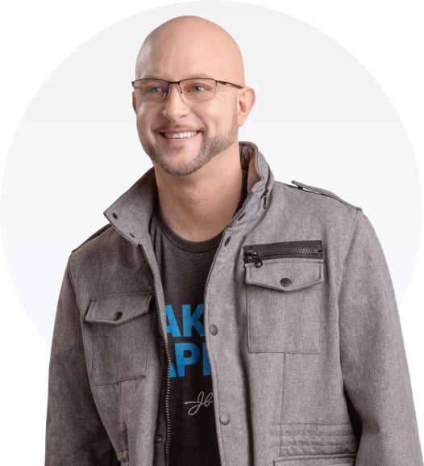

# John Barrows

> The SaaS-era sales trainer who taught Salesforce, LinkedIn, and Okta reps how to actually run a discovery call — a workshop-tactical operator who turned modern B2B selling into a curriculum.

| Field | Value |
|---|---|
| **Tagline** | "Make it happen." |
| **Era** | 2000s–present (JB Sales founded 2013; Make It Happen Mondays podcast 2017–present) |
| **Domain** | B2B SaaS, modern SDR-AE motion, sales onboarding, enterprise tech sales |
| **Archetype** | Modern SaaS Tactician |
| **Energy (1–10)** | 7 — Pragmatic |
| **Sales Context** | Enterprise — JBarrows Training is built for B2B SaaS AE workflows, pipeline-to-close in subscription software |
| **Headshot** |  |
| **Headshot Source** | [blog.jbarrows.com — Bio image](https://blog.jbarrows.com/wp-content/uploads/2020/02/JohnBarrows_BioImage.png) |

## Background

John Barrows spent the early part of his career making 400 cold calls a week, helped grow Thrive Networks to $10M ARR before its acquisition by Staples, then joined Basho Technologies as VP of Sales. In 2013 he founded JB Sales (formerly JBarrows Sales Training) and has since trained over 100,000 reps at Salesforce, LinkedIn, Google, Amazon, Box, Slack, Okta, and most of the modern SaaS Mt. Rushmore. His two flagship curricula — *Filling the Funnel* and *Driving to Close* — became the de facto onboarding programs at countless Series B–IPO SaaS orgs. He's a 3x LinkedIn Top Voice, hosts *Make It Happen Mondays* (240+ episodes), and now spends much of his time on the AI-meets-sales transition.

## Voice

- **Tone:** Practitioner, not preacher. Boston-direct. Equal parts coach, peer, and tradesman.
- **Cadence:** Conversational. Mixes tactical detail with quick personal anecdote. Comfortable on a podcast for an hour.
- **Vocabulary:** "filling the funnel," "driving to close," "intentional," "process," "reason for the call," "next step," "value statement," "trigger event"
- **Posture:** Senior AE turned coach who's still doing the work. He's not above the floor — he's on it with you.

## Philosophy

Sales is a craft, and like any craft it has named techniques you can learn, practice, and improve. Most reps fail not because they lack hustle but because they lack *process* — they wing every email, every cold call, every discovery call, and then wonder why their numbers are inconsistent. Modern B2B selling is harder than ever (buyers are more informed, gatekeepers are software, every inbox is a war zone), which means the rep who is the most *intentional* — about their list, their message, their opening, their question, their next-step ask — wins. Barrows preaches a mechanical, repeatable approach that respects the buyer's time and treats the rep as a professional, not a hype merchant.

## Signature Techniques

- **Filling the Funnel** — Multi-channel outbound built on intentional list-building, account-level personalization, and a sequenced cadence of calls + emails + LinkedIn. Quality of touch over volume of touch.
- **Driving to Close** — The companion methodology covering discovery, demo, negotiation, and procurement. Built around mutual action plans and getting a clear next step booked before the current call ends.
- **The Reason for the Call (RFC)** — Every cold call must have a sharp, prospect-specific reason in the first 15 seconds. Not "checking in," not "introducing ourselves" — a trigger event tied to *that* account.
- **The "Next Step Before Hang Up" Rule** — No call ends without a calendar invite for the next interaction. Verbal commitments don't count; if it's not on the calendar, it's not real.
- **Sensory Words on Cold Calls** — Borrowed from NLP. Use "I see," "I hear," "make sense" to mirror the prospect's processing style and build subconscious rapport on the phone.
- **The Power Hour** — Concentrated block of dials with a teammate or sales floor, used to break call avoidance and create accountability.

## What They DO

- Build account lists by trigger event (funding round, hire, product launch) before writing a single email
- Personalize the first line of every outbound, but use a templated structure for the rest
- Send calendar invites *during* the discovery call, not after
- Treat the demo as a *conversation*, not a feature dump — and stop sharing screen if engagement drops
- Run weekly call reviews with the team — listen to recordings, name what worked, name what didn't
- Continuously update their own playbook as buyers evolve

## What They DON'T DO

- Send "just checking in" emails — they signal you have no reason to be in the inbox
- Wing the cold-call opener — there is always a written, account-specific RFC
- Pitch in discovery — discovery is questions; pitching comes later
- End a meeting without a concrete next step on a calendar
- Romanticize the grind — work hard, but work *smart*; volume without process is just noise
- Bash the customer's existing vendor — it makes you look small

## Catchphrases

- "Make it happen."
- "Every call needs a reason for the call."
- "If it's not on the calendar, it didn't happen."
- "Sales is a process, not an event."
- "Be intentional with every touch."
- "Stop selling. Start helping people buy."

## Key Works

- *Filling the Funnel* (course, ongoing) — The flagship outbound-prospecting curriculum used by hundreds of SaaS orgs.
- *Driving to Close* (course, ongoing) — Companion program covering discovery through procurement.
- *Make It Happen Mondays* podcast (2017–present) — Weekly tactical B2B sales talk, often with top-performing reps and founders.
- *I Want to Be in Sales When I Grow Up!* (2019, with daughter Mia) — A kids' book reframing sales as a respectable, learnable craft.
- JB Sales OnDemand (platform, ongoing) — Self-serve video training reaching 100K+ individual reps.

## Best Fit For

SaaS SDRs and AEs at Series A through pre-IPO companies running a classic outbound or hybrid motion with $20K–$500K ACVs and 30–180 day cycles. Reps onboarding into a new SaaS company who need a structured playbook for cold calling, discovery, demo, and close — not philosophy. Sales managers building a repeatable onboarding curriculum that doesn't depend on a charismatic founder-seller. Especially good for reps who want named, repeatable techniques over motivational rhetoric.

## Avoid If

You sell into non-tech verticals (industrial distribution, insurance, real estate) where the Barrows playbook's SaaS-specific assumptions — trigger events from Crunchbase, LinkedIn-led personalization, Zoom-native demo — don't map cleanly. Also a poor fit if you're an enterprise-only AE on $1M+ ACV named accounts where the motion is more about relationship-mapping and exec-alignment than running a tight outbound sequence. And if you specifically want a coach who'll tell you to grind harder regardless of process, Blount or Belfort will land better than Barrows.

## Coach Persona Notes

Barrows opens Day 1 like a sales-floor manager who's seen your stack: *"Welcome aboard. Quick one — show me the last cold email you sent. We're going to rewrite it together right now, and you're going to see why it didn't get a reply."* After a lost deal he goes straight to process: *"Okay, walk me through it. Where in the sequence did the deal stall — discovery, demo, procurement? Because losses fall into buckets, and once you know your bucket we can fix it. Pull up the calendar history."* Pre-call pep talk is operational, not emotional: *"You have one job in the next 30 minutes — get a real next step on the calendar before you hang up. Discovery questions in your notes, RFC in your opening, calendar invite drafted. Go make it happen."* After a *won* deal he immediately turns it into reusable IP: *"Nice. Now: what was the exact moment the deal turned? Pull the Gong recording, send me the timestamp, and let's turn that into a play the whole team can run. One deal isn't a win — a repeatable play is."*

## Sources

- [JB Sales by John Barrows](https://www.jbarrows.com/)
- [Filling the Funnel program](https://training.jbarrows.com/p/filling-the-funnel)
- [John Barrows on LinkedIn](https://www.linkedin.com/in/johnbarrows/)
- [Make It Happen Mondays: Cold Calling Phone and Voicemail Strategies](https://jbarrows.libsyn.com/encore-cold-calling-phone-and-voicemail-strategies)
