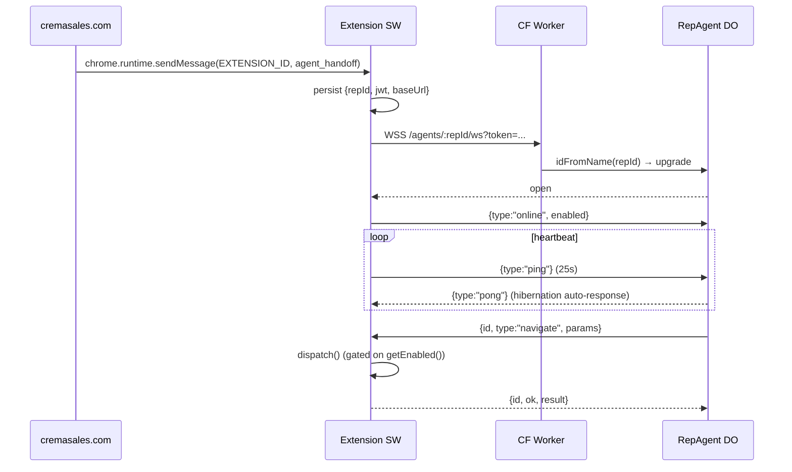

# Crema Sales Agent — Browser Extension

> [!IMPORTANT]
> **Status: BETA — under active development.** Treat every build as a pre-release.
> The website handshake contract, command surface, and `chrome.storage` shape are
> all subject to change between releases. If you're testing in production, expect
> to re-download the build often and to occasionally need to remove + reinstall
> after a breaking change. File issues — that's the fastest way out of beta.

MV3 Chrome extension that gives the **Crema Sales** CRM a rep-side agent control surface. The extension dials an outbound WebSocket to a per-rep `RepAgent` Cloudflare Durable Object and executes browser commands (navigate / click / type / snapshot / screenshot / allowlisted eval) on behalf of the agent loop — **gated on a rep-owned toolbar master switch**.

**Protocol contract:** [`../shared/agent-ws-protocol.md`](../shared/agent-ws-protocol.md). Both the extension and the DO MUST conform.

## Architecture



## Install

### Dev (load unpacked)

```bash
bun install
bun run build      # → dist/
```

1. `chrome://extensions`
2. Toggle **Developer Mode** on.
3. **Load unpacked** → select `dist/`.
4. Open the service worker DevTools (link on the extension card) to watch logs.

The toolbar icon starts **grey (OFF)** — the master switch defaults to disabled.

### Production

Chrome Web Store (TODO: listing URL). Updates are auto-distributed.

## Configuration

After install the extension is dormant until it has connection credentials. Two paths:

1. **Website handshake** (production). The rep logs in at `cremasales.com`; the site calls
   `chrome.runtime.sendMessage(EXTENSION_ID, { type: "agent_handoff", repId, jwt, baseUrl })`.
   The extension persists the credentials and dials.
2. **Manual** (dev). In the SW console:
   ```js
   chrome.storage.local.set({
     agentBaseUrl: "ws://localhost:8787",
     agentRepId:   "test-rep",
     agentJwt:     "<dev-token>",
   });
   __cremaAgent.socket.connect();
   ```

## Website Handshake Contract

The site MUST be in the `externally_connectable.matches` list of [`manifest.json`](./manifest.json) — currently `https://cremasales.com/*` and `http://localhost:*/*`.

```ts
// in the marketing/app site, after the rep logs in
chrome.runtime.sendMessage(EXTENSION_ID, {
  type:    "agent_handoff",
  repId:   "<rep uuid v4 OR lowercased email>",
  jwt:     "<HS256 token, sub=repId, signed with JWT_SECRET>",
  baseUrl: "wss://ctrl-alt-elite-agent.workers.dev",  // see allowlist below
}, (resp) => {
  // resp = { ok: true } on success
  // resp = { ok: false, error: <code> } on failure. Codes:
  //   invalid_payload | unknown_type | missing_fields
  //   malformed_repId    — failed UUIDv4 or lowercase-email regex
  //   baseUrl_not_allowed — not in ALLOWED_BASE_URLS (see src/background/validate.ts)
});
```

**`repId` format** (`src/background/validate.ts`): either a UUIDv4 (`xxxxxxxx-xxxx-4xxx-[89ab]xxx-xxxxxxxxxxxx`) or a lowercased email. Anything else is rejected client-side and the extension stays dormant.

**`baseUrl` allowlist** (`src/background/validate.ts:30`): only these dial targets are accepted. Update both ends if the canonical Worker URL changes.

```
wss://ctrl-alt-elite-agent.workers.dev   (production)
ws://localhost:8787                       (local dev)
ws://127.0.0.1:8787                       (local dev)
```

JWT format: see [`../shared/agent-ws-protocol.md` § Authentication](../shared/agent-ws-protocol.md).

## Terminal Close Codes

The DO can shut the channel down so the extension stops retrying. Anything else triggers the standard backoff-and-reconnect ladder.

| Code | Meaning | Extension behavior |
|---|---|---|
| `4401` | JWT invalid or expired | Wipe cached JWT + repId; stop reconnecting until a fresh `agent_handoff` arrives |
| `4403` | Rep banned/disabled by server | Same as 4401 — fresh handoff required |
| any other | Transient | Exponential backoff, 1→60s, jittered |

## Command-ID Dedup

If the DO replays a command id we already acked (e.g. our ack was sent but the socket dropped before the DO removed the entry from its queue), the extension replays the cached response from an in-memory LRU (capacity 256). It does NOT re-execute the command — that would cause double clicks / double navigations.

The cache is per-SW-lifetime; a cold start loses it. Accepted tradeoff vs. persisting every ack to `chrome.storage`.

## Integration Smoke Tests

Standalone scripts to validate the deployed backend without loading the extension. See [`scripts/integration/README.md`](./scripts/integration/README.md).

```bash
export AGENT_BASE_URL="http://localhost:8787"  # or the deployed URL
bun run test:integration test-rep              # runs all 5 scripts in order
```

## Master Switch UX

- **Toolbar icon: grey** → OFF. Extension responds `{ok:false, error:"rep_disabled"}` to every command. Heartbeats continue so the DO knows the rep is alive.
- **Toolbar icon: green + "ON" badge** → ON. Commands dispatch normally.
- Click the toolbar to flip. State persists across browser restart.
- Logs in the SW console (`chrome://extensions` → service worker → inspect): `[crema-agent] …`, `[agent] …`, `[toggle] …`, `[dispatch] …`.

## Smoke-Test Checklist

Run with `wrangler dev` on `localhost:8787` and the extension loaded unpacked.

- [ ] Set storage to point at localhost, call `__cremaAgent.socket.connect()`, watch `wrangler tail` for the upgrade.
- [ ] Confirm `{type:"ping"}` arrives every 25s and the DO auto-response sends `pong`.
- [ ] Toggle OFF, POST `/agents/test-rep/act` with `{type:"navigate",...}` → expect `{ok:false, error:"rep_disabled"}`.
- [ ] Toggle ON, POST the same → expect `{tabId: …}` and the active window navigates.
- [ ] POST `{type:"screenshot", params:{tabId:<id>}}` → expect base64 PNG `data_url`.
- [ ] POST `{type:"snapshot", params:{tabId:<id>}}` → expect HTML string ≤1MB.
- [ ] POST `{type:"click", params:{tabId:<id>, selector:"button.cta"}}` → button clicks; bad selector → `{error:"selector_not_found"}`.
- [ ] POST `{type:"type", params:{tabId:<id>, selector:"input[name=email]", text:"a@b.com"}}` → field fires React `input` event.
- [ ] POST `{type:"eval", params:{tabId:<id>, name:"page_title"}}` → `{value: "<title>"}`. Unknown `name` → `{error:"eval_not_allowlisted"}`.
- [ ] Kill `wrangler dev` and watch the extension log reconnect attempts with backoff. Restart wrangler and confirm it reconnects.

## CWS Publishing Checklist

- [ ] Privacy policy URL (TODO).
- [ ] Listing screenshots: toolbar icon grey (OFF) and green (ON); the rep's CRM tab being navigated programmatically.
- [ ] Permission justifications:
  - **`<all_urls>` host permission** — The extension's purpose is to drive whatever third-party SaaS surfaces the rep is logged into (LinkedIn, Gmail, Salesforce, HubSpot, custom internal tools). Restricting to a fixed allowlist would defeat the product. The master switch gives the rep explicit consent.
  - **`debugger` permission** — Required for CDP-mode `click` and `type` against SPAs (LinkedIn, Gmail, Salesforce) that ignore synthetic `MouseEvent`/`KeyboardEvent` from `document.querySelector(...).click()`. Used only on the active rep's tab while the master switch is ON; attach/detach is bounded per command in `dispatch.ts`.
  - **`scripting`** — Standard DOM click/type/snapshot via `chrome.scripting.executeScript`. Code is bundled at build time; no server-supplied strings ever reach `executeScript`'s `func` parameter or the `Function` constructor (see `dispatch.ts` allowlist).
  - **`alarms`** — Keep the MV3 service worker reachable for incoming commands (raw timers don't wake a dead SW).
  - **`storage`** — Persist the rep's `repId`, `jwt`, `baseUrl`, and `agentEnabled` toggle in `chrome.storage.local`.
  - **`webRequest`** — Observation only (no `webRequestBlocking` — the extension never blocks, redirects, or modifies a request, and shows no "being controlled" banner). The network intent router watches the rep's own XHR to the comms surfaces they enabled (Gmail, Outlook, LinkedIn) to detect "email sent" / "message sent" from the request body instead of scraping unstable vendor DOM. Gated by the master switch and the per-site allow-list; capture rules narrow matching to specific endpoints, so arbitrary traffic is never inspected.

## Source Layout

```
src/background/
  index.ts        # SW entrypoint: socket + toggle + dispatcher wiring, handoff listener
  ws-client.ts    # AgentSocket: connect/reconnect/heartbeat
  toggle.ts       # master switch + visual state
  dispatch.ts     # command surface (navigate/click/type/snapshot/screenshot/eval) + CDP variants
scripts/build.ts  # esbuild bundle + static asset copy → dist/
manifest.json     # MV3 manifest (copied into dist/ by build)
icons/            # toolbar PNGs (green on, grey off)
```

## Build

```bash
bun install
bun run build      # → dist/
bun run dev        # watch
bun run typecheck
```
